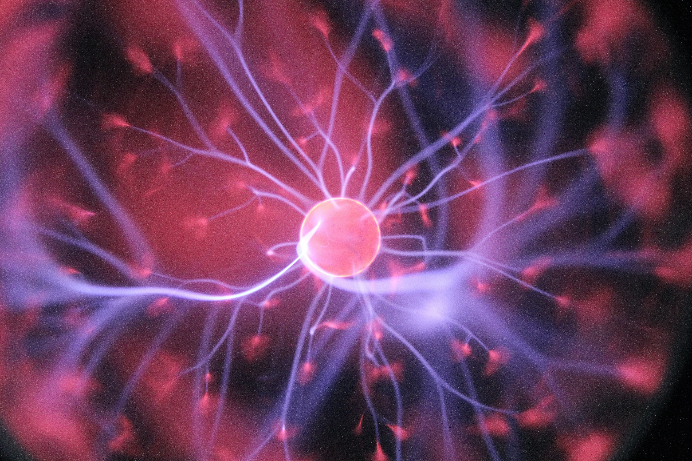
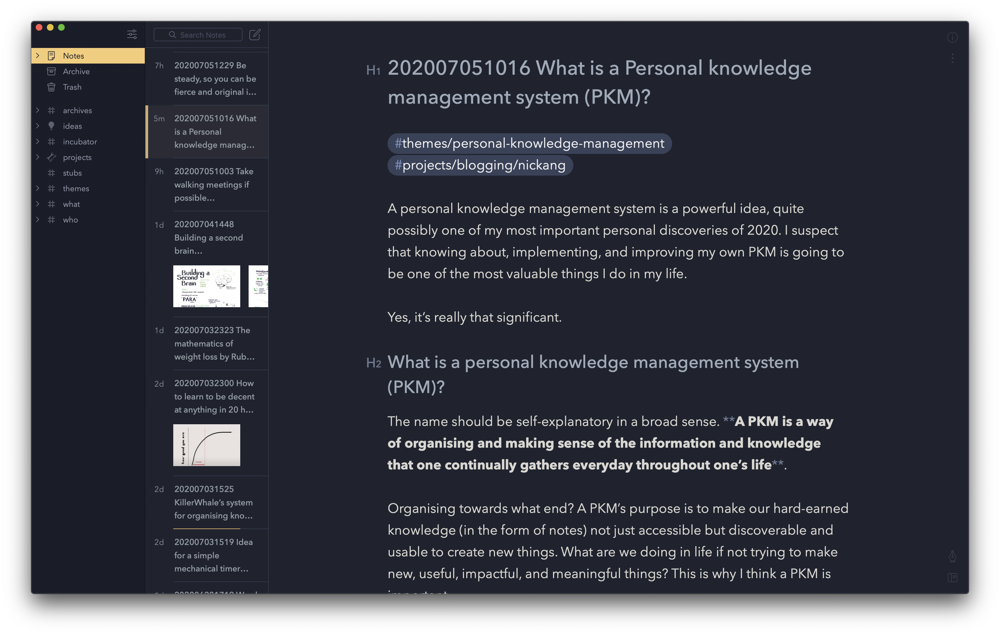

_Photo by Halacious_

A personal knowledge management system is a powerful idea, quite possibly one of my most important personal discoveries of 2020. I even suspect that knowing about, implementing, and improving my own PKM is going to be one of the most valuable things I do in my life.

Yes, it’s that significant.

## What is a personal knowledge management system (PKM)?
The name should be self-explanatory in a broad sense. **A PKM is a way of organising the information and knowledge that one continually gathers everyday throughout one’s life**.

Organising towards what end? A PKM’s purpose is to make our hard-earned knowledge (in the form of notes) not just accessible but discoverable and usable to create new things. What are we doing in life if not trying to make new, useful, impactful, and meaningful things? This is why I think a PKM is important.

Now to be precise, a PKM consists of operationalising a structure and workflows around notes - the basic atom of knowledge. More on that in a bit. For now, I’ll delve deeper into my personal “why”.

## Why do I use a PKM?

I know people tend to say “I have always wanted…” a lot, but in this case I’m going to say it deliberately: I have always wanted to implement a way of managing my notes properly. Intelligently.

My notes are strewn in various forms across moleskine notebooks, random pieces of paper, and a plethora of apps. They have always felt like radioactive matter - so much untapped potential energy, decaying slowly in time instead of being actively harnessed to electrify my life.

I have used note-taking apps since Evernote was a startup with a bright future, which is to say, for around a decade now. Evernote and other note-taking apps have been doing what they were designed to: sync multi-media notes across my laptops and phone. The technology never failed me - I merely failed to use the technology appropriately. I believe most people’s PKM systems, whatever form they take, fail because of lack of an overarching process, not because they are using the wrong tool.

This is how I would describe the evolution of my thinking about note-taking and how it loosely relates to the idea of a PKM since I started taking notes digitally:

- __2011 (just before university)__: It’s like I have an external hard drive storing all these precious info! I am now a [cyborg with augmented memory](/2020-02-23-how-i-think-about-memory)
- __2013 (2nd year at university)__: It’s like a labyrinth that is full of useful things tucked in different boxes hidden behind a ton of other “why the hell is this even here” boxes
- __2016 (started first job and learning a lot)__: It feels like notes are just meant to be ephemeral pieces of information not meant to be organised. I give up trying to make my life’s notes organised. I’ll just publish blog articles about things and that shall be good enough
- __2019 (just before relocating to Berlin)__: Oh, what is this zettelkasten thing that this author is talking about in his book [How to Take Smart Notes](https://www.goodreads.com/book/show/34507927-how-to-take-smart-notes)? Maybe I have been thinking about notes in a fundamentally flawed way all along. Let’s give it a shot
- __2020 (in Berlin)__: Now *this* feels right. It’s easy to know where a piece of knowledge or information needs to go now, and oh look, I linked this note to the other before. Hmm, why did I do that? Oh, it’s because… _/holds up newly written note that is going to be published on my blog_

That list came out longer and than I had anticipated, but it does a good job of describing my tenuous relationship with note-taking systems. A love-hate relationship. _I wanted so badly to like you…_

Turns out, thinking about the whole enterprise as a note-taking system shines the spotlight on the wrong thing. All along I have been wanting a personal knowledge management system, not just a note-taking system.

So, why do I use a PKM? Because I have been yearning for a decade to feel confident that I’m creating notes that will elevate my life, not weigh it down.

## What does setting up a PKM involve?

This is the natural question to ask after hearing the promise of a PKM. I remember clearly how I felt when I was reading How to Take Smart Notes and the promise of a PKM (in the specific form of a “Zettelkasten” or slip-notes box). _Holy crap, this is what I’ve been looking for since literally always. I’m sold, now tell me how such a system is actually operationalised!_

I will share what setting up a PKM involves, but not before I share a disclaimer: I am still a rookie at this. Yes, I have chosen my tool and started to consistently use some processes to operationalise my own PKM, but it is far from perfect. I only dare say that what I have setup _feels_ right for me at this point. Never lose track of the fact that everyone’s PKM will need to be slightly different and that each of our PKMs is a perpetual work in progress, shapeshifting to fit our evolving personal circumstances as we march on in our life.

So, what does a PKM consist of? How do you set one up?

 
_A glimpse into my PKM!_

A PKM consists of a chosen software tool, a clear private agreement on certain constructs (what is a note? what will I use tags for?), and a few workflows (progressive summarisation, cross-linking).

For example, at the moment my PKM setup looks like this:

- Tool: [Bear app](https://www.nickang.com/2018-11-02-bear-app-im-ready-for-you/) as the repository of my notes
- Agreement: There are only 2 kinds of notes: a note containing an atom of knowledge, and a note for pulling together other notes to synthesise something (e.g. this blog article is written as the latter kind of note in my PKM)
- Workflow: I always add a timestamp in the note’s title to function as a unique note id (I use an Apple Automator script and keyboard shortcuts to do this). It also helps sorting by note title chronologically regardless of app I use
- Workflow: I never clip information from the web or a passage from a book without adding my thoughts and bolding some passages in the new note at the time of creating it
- Workflow: Before I close a note, I always make an effort to search my existing notes to see related notes and consider how they are related to the current one - and if they are, I leave an internal link and maybe a comment
- Workflow: When I land on an old note and see something that resonates with me, I highlight those parts
- Agreement: I use tags, and a note can only ever have between 1-3 tags
- Workflow: I keep top-level tags to a minimum. Currently there are 7 top-level tags: archives, ideas, incubator, projects, themes, what, who

With this setup, which probably looks surprisingly like any other person’s digital notebook app on the surface, I have my own operational PKM that feels right for me. 

I deliberately kept my description of the “how” short in this article to provide a _sense_ of what an operational PKM looks like. In a future article (TK), I’ll dive into the detailed state of my PKM in 2020. Stay tuned!

**Credits due**: Just to be clear, I did not come up with this idea of a PKM. I don’t know who did, but I stumbled on this whole thing from a tweet by [Tiago Forte](https://twitter.com/fortelabs) and I became acquainted with the idea through—surprise surprise—a set of [beautifully illustrated notes by Maggie Appleton](https://maggieappleton.com/basb) about his course called Building A Second Brain (BASB). Another source of information is Ahrens’ book [How to Take Smart Notes](https://www.goodreads.com/book/show/34507927-how-to-take-smart-notes).

---

**NEW (21.02.2021)**: I published a [new post](/2021-02-21-obsidian-roam-why-i-am-staying-with-bear-as-my-pkm/) on how I experimented for 3 weeks with Roam Research, Obsidian, and decided to stay with Bear as my PKM software.

**NEW (25.07.2021)**: I changed my mind again because I saw [7 Signs that my Knowledge Management process is broken](/2021-07-25-7-signs-that-my-knowledge-management-process-is-broken/).

**NEW (29.08.2021)**: Want to dive deeper into personal knowledge management? I wrote more, read it here: [Types of Notes in a PKM explained with a Gardening Analogy](/2021-08-29-types-of-notes-in-a-pkm-explained-with-a-gardening-analogy-part-i/).