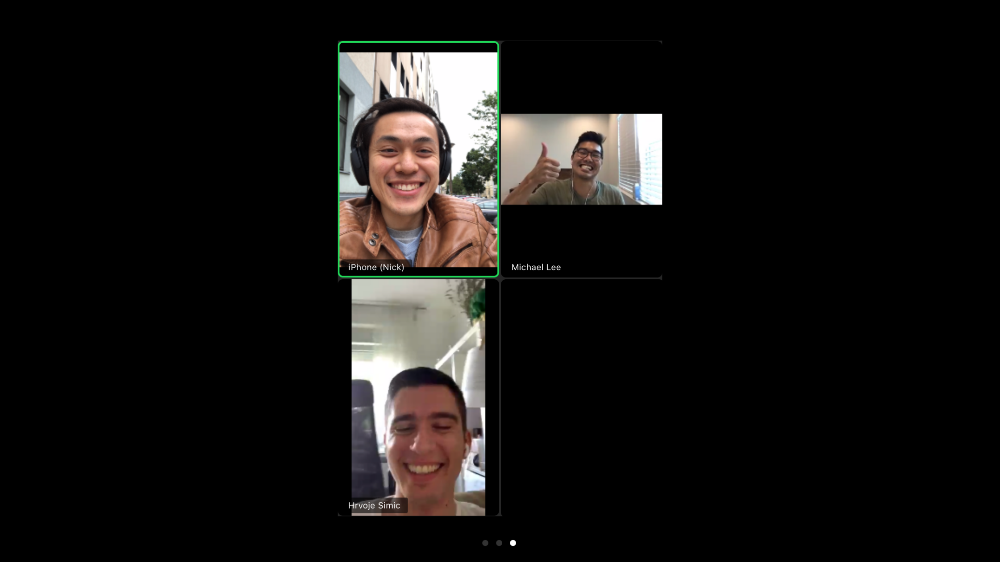

Today I experienced something I haven’t experienced ever before: I spoke to two people I know only from twitter. We are on a [journey to write more regularly together](/2020-06-28-word-rafting), a part writing support group, part "let’s try this thing and talk about our blogs and life and whatever comes up" group. I hung up from our 30 minutes chat energised and I wanted to write about it right after it happened, but I had more work to finish and couldn’t.

_3 strangers who just became friends because of our shared motivation to write more regularly. I can hardly contain my excitement!_

Normally this state of being denied my urge to write would make me quite stressed, because it feels like the inspiration is slowly dissipating into the air and escaping my grasp, but this time was different.

Perhaps it’s because I have been meditating daily for over 70 days today (based on my stats on the [Calm](https://calm.com) app), I was able to take a step back and tell myself instead not to sweat it. Now is time to do my other task, my other duty. 

There is a wonderful feeling of calmness when you realise that there is no need to do something right now, *right now*, even if you really want to. Do or don’t, you are still you. The earth continues to revolve and the winds continue to blow. I basically told myself, _look, it’s really good that you are feeling energised and enthusiastic about writing this piece, but right now your attention is needed elsewhere, so tend to that first. Don’t sweat about not writing right. There is a right now waiting for you later. That’s the right right now._ All the [calmness comes from within](/2018-08-12-all-the-peace-from-within).

The ironic thing is of course that I am sitting down to write something right now and I am _not_ writing about the wonderful things that transpired during my call with my new “word rafting” buddies. But this is deliberate. I wanted to make a clear point to myself: **there is no need to stress about not doing things**. I should trust my character, my discipline, and my workflow to make me circle back to what is important. If writing about this experience is important to me, I will come back to it and type on that keyboard.

For now, what I have done is write a few key points in the comments of an item in my todo list and left it as that. No need to stress about it any further. I can now enjoy my after-work evening with my wife and dog.

This technique of tucking away an item with a scheduled re-surfacing was something I didn’t purposefully design but inadvertently started doing when I [started using Todoist](/2020-03-25-moving-from-wunderlist-to-todoist). I articulated it to Shime and Michael during our call for the first time and surprised myself that I even had a process for this. I love it when someone’s question helps me realise something about myself. Perhaps someone has a name for such a technique, but I like the sound of the “boomerang” technique (TK). I'll expand on that idea in a future article.

Life is short and some of us want to accomplish a lot of things, but it is precisely because we have limited time that I think we should relax a bit more. When time has almost run out and Death stands looming over my face and counts aloud my last minutes, I know I would be more satisfied knowing that I had lived a good life of being more calm and appreciative of each moment, rather than knowing that I had squandered hundreds of hours being stressed about something that didn’t get done when I felt like I wanted to get it done.

Not now.