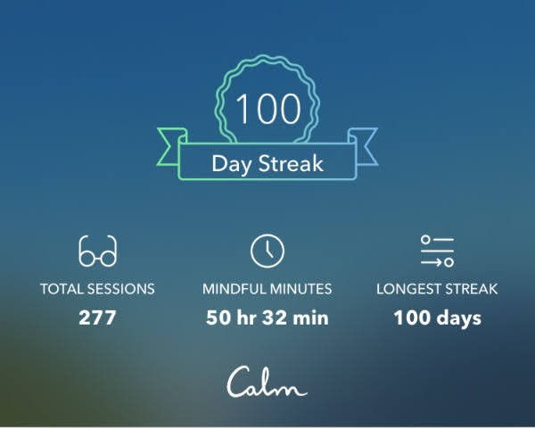

This week I crossed the 100 day streak of meditating daily!

*My 100 day streak on the Calm app*

I go into details of my journey in this article, but before you take this as your roadmap, please bear in mind that I'm very much still a novice myself. Meditation is to build mindfulness, and mindfulness is a muscle that requires continual practice like physical exercise. I'm still in the early stages of building the muscle, so some of my answers will probably be different if you asked me a year later.

Anyhow, here are my thoughts on mindfulness after 100 days of daily meditation.

## Why do you meditate?

Meditation as a way to take control of one's own mind? This is one area of my life that I don't feel I need science to prove anything. It just makes sense to me that meditation would help me become calmer about life itself. I want to be calm in my life, so I meditate.

## What happens when you're meditatating?

Physically, I just sit still on my couch, feet on the ground, hands on my thighs, back propped upright against a cushion against the sofa's back. I keep my eyes closed and always begin with 3 deep breaths.

Although nothing is supposed to happen — you really are literally just sitting down as the world continues to hum — it is paradoxically when you are still that you realise that in the background, *a lot* is actually happening. Your mind is abuzz! Without you knowing!

So during a meditation session, I focus my attention on my mind, as opposed to the default where I focus on everything external of my mind. I'm just breathing… until I realise my mind went down *yet another* rabbit hole of worry without my consent. 

When I notice it, my mind comes back up from the hole I just see a hole from the surface. Most of my meditation sessions so far are about noticing rabbit holes (or any other metaphors, like buses on a highway, clouds in the sky), which always, without fail, makes them look terribly boring.

Sometimes when I see the hole and it disappears, it makes me smile.

## How long and when do you meditate each day?

I meditate as the third thing I do every morning, right after using the bathroom and drinking a glass of water. I didn't think of it as habit stacking but that is exactly it, as James Clear calls it in his book *Atomic Habits*.

Right now I meditate for 10 minutes every session, and I do it once a day.

## Do you use any tool to help you meditate?

Yes, I use the [Calm](https://www.calm.com/) app with a premium subscription. The [company I work at](https://smartly.io) gave every employee a year of subscription as a Christmas present in 2019 and I think it is probably the best corporate gift ever.

When I meditate, I put on my wireless earphones connected to my iPhone, launch the Calm app, pick a session, and close my eyes and start meditating. Here is a rough breakdown of the sessions I pick from the app:

- 30 days of how to meditate with [Jeff Warren](https://jeffwarren.org/) -> 10% at the beginning of my journey
- Daily Calm (fresh guided meditation released daily for subscribers) -> 40% and reducing
- Timed meditation -> 50% and growing

After the 30 days course on how to meditate, I started to feel more comfortable doing unguided meditations. For these sessions nowadays, I still use the Calm to play nature sounds in the background and time each session. 

Counting my daily streak is not important to me in any way apart from compelling me to know how long I've kept up with the daily practice and to write articles like this to take stock of my growth.

On tools, I have heard friends using a free meditation library like [Insight Timer](https://insighttimer.com/) with good results. I tried it briefly and I think it's good. If I don't have a Calm subscription anymore, I think I'd be happy with this.

## What does it feel like to have meditated daily for 100 days?

It feels cool, like I'm in some kind of club, but to be honest I don't really keep up with the count or look forward to hitting 100, for example. It's just a number the represents the formation of a habit that I want.

## What are some of the benefits you have seen?

I have seen some important differences in my life.

My mood has become much more stable throughout any given day. Whereas previously I would, without noticing, let my mood be hijacked by something not going my way, now I actually occasionally notice my mood taking a swing and I pause and search for the root cause.

Sometimes it's something a colleague said, a tweet that could be interpreted negatively, or the way some person I don't know looked at me when I chose to reprimand my dog for barking at another dog in public. 

Apparently in Iceland there's a word for "window weather" , *gluggavedur*, which is suitable as a metaphor here. People are erratic, and when they do what they do, my mind often picks up cues and creates a storm inside that makes me miserable.

Because of meditation, however, I have become more adept at noticing these storms as they begin to brew. Whenever I notice my mind doing something I had previously not noticed, the whole thing becomes inert. This happens because the storm is caused by something in the past or future. In other words, because of something that exists only in my mind. And once I see that for what it is, I'm reminded that the only way it can stir things up inside me is if I let it.

And so, I regain control, or as Jeff Warren would say, I "pop out".

Once I pop out and become an observer of my own mind, I can then have a little fun, like stay in bed watching the *gluggavedur* from my observatory. This brings with it an odd sense of satisfaction.

So, this **newfound ability to "pop out" leads to a more stable mood** and is probably the biggest benefit I have gotten from meditating so far.

There is one other benefit worth talking about. In Japanese there is an expression, *kotsu kotsu*, which means to live step by step. I heard this from one of the Daily Calm sessions. It's the idea that when you do one thing, you should just do that one thing.

For example, when brushing your teeth, just brush your teeth. When sowing seeds in the earth, take time to dig into the soil and space the seeds out instead of impatiently waiting for the seeds to germinate into saplings. I think it also means to recognise that it is okay to say "[not now](/2020-07-10-not-now)" to a thing you actually want to do right now if a colleague, your wife, child, or pet needs you.

So, the second big benefit is that I am now able to see clearly that **I do have time**. Before I meditated regularly I worried constantly that there wasn't enough time in any given day to do everything I want to get done. No *kotsu kotsu*. Nowadays, I realise that if I feel like there is not enough time in a day, it is not because I literally have too many tasks to fit in 16 hours. **It is because many of those hours have been robbed by my unchecked mind, being busy being busy, without me knowing**. Once I know, the mindlessness is replaced by mindfulness, and every minute feels more like five.

## How did you get to 100 days? Any tips?

What helped me most with establishing meditation as a daily practice is waking up early to mediate. To meditate daily, start with the logistical task of figuring out what is the best time to meditate *for you*.

For me, that time is the morning for two equally important reasons:

1. Nobody else is awake in my home, so I have no obligation to explain anything to anyone and I can just sit and meditate.
2. The mindlessness begins from the moment I awake to a new day, and the mindfulness that comes after meditating is most needed from the morning.

On #1: A 10 minutes sit down takes 10 minutes to sit down, but if before the sit down you also need to finish walking the dog and communicating with your wife that you are about to meditate, then it will take much more than 10 minutes. It will even *feel* like much more than 10 minutes. This is why I choose to meditate in the morning, right after I get out of the bathroom fresh and gulp down a glass of water. In the morning there is no need to talk to anybody. Even my dog is still asleep.

On #2: Assuming meditating helps clear my mind, then doing it in the morning means I get to reap the benefits of a clearer mind for *more* of the day.

I believe that once you find a suitable time in your day to meditate that works every single day without much friction, you will be able to establish meditation as a new habit. Perhaps this can be generalised to forming any new habit, but it's especially applicable to something that requires quiet like meditation. Carving out this time may involve shifting or eliminating other habits, though, so it may not be easy. For me, I had to eliminate late-night Netflix so that I can sleep early and wake up before my wife so I can meditate in the morning alone without disruption, and without being groggy at work during the day.

## Now that you hit 100, what's next?

I want to continually improve as a person through meditation. There are few things about mindfulness that I want to work on next:

- Get frustrated less at people when they are not doing things the way or to the level that I expect them to do.
- Be able to effectively meditate in a noisier environment instead of just in the quiet of the home, so I can meditate more often than once a day, like having a portable reset button.
- See and articulate more clearly the effects that bing mindful has on my life and those around me, so that I can speak more succinctly about it with people. I would love to live in a world increasingly inhabited by people who are present and mindful.

Oh, and in case you wonder if I would recommend you to meditate as well - the answer is yes. Or as the author [Derek Sivers](https://sivers.org/hellyeah) likes to say, *hell yeah!*