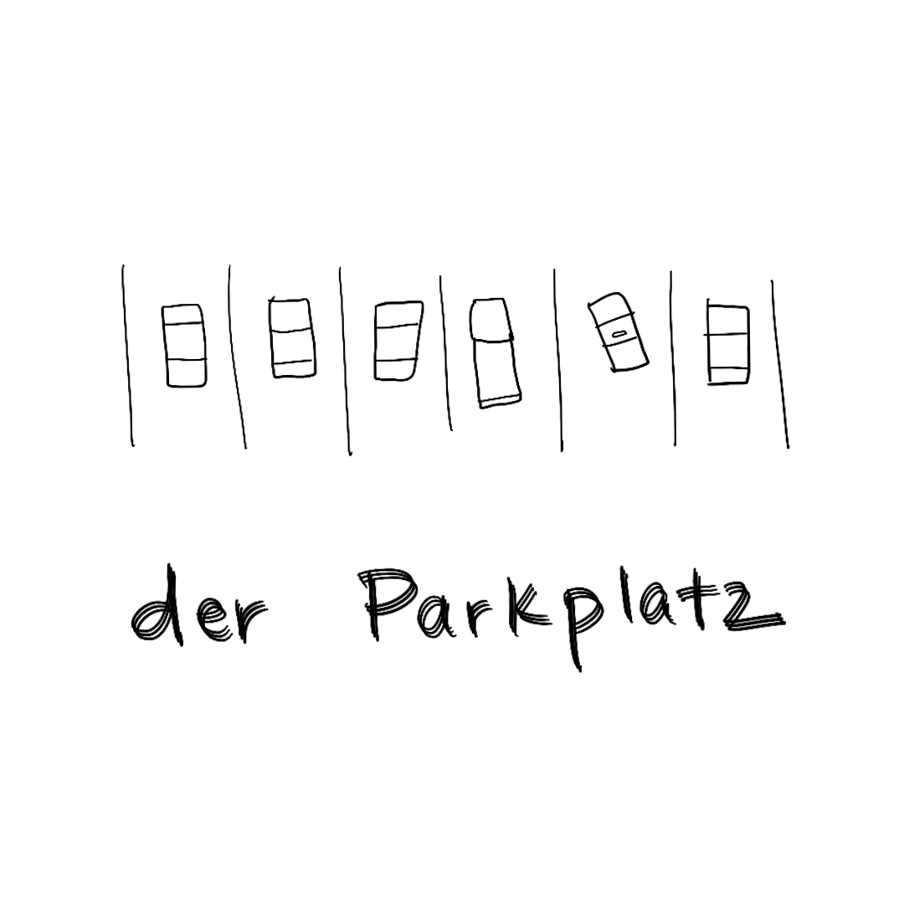
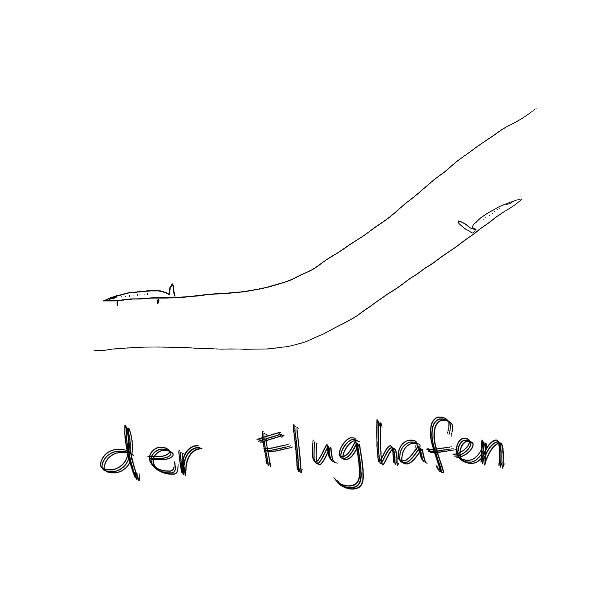
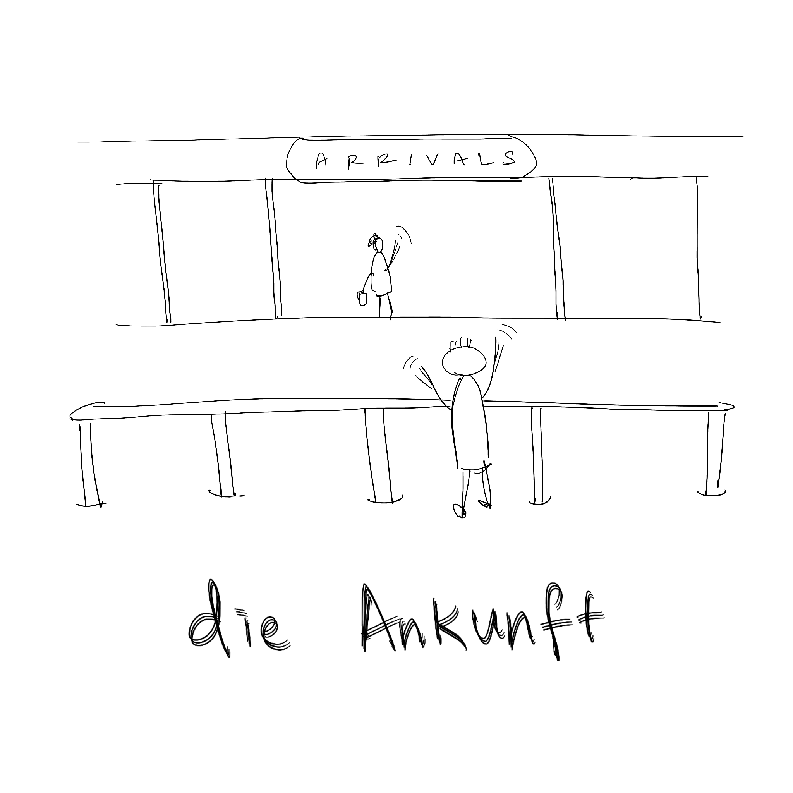

I'm learning German now and I wanted to find a fun way to remember words. Yesterday, a colleague of mine went to a bookstore to buy a pretty book full of drawings that illustrated German words. I thought to myself, "that looks fun".

So here is my hobbyist rendition of a drawing book - the first 3 entries. I want to say "Enjoy!" but I'm apprehensive. Oh what the heck, enjoy!

