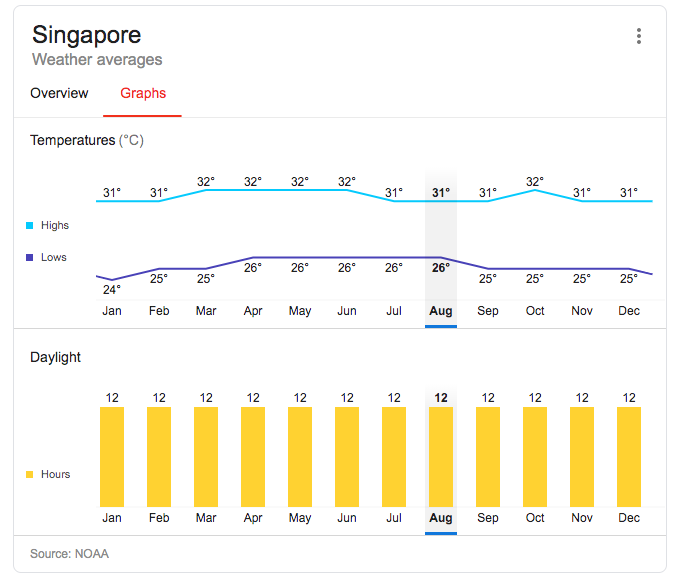
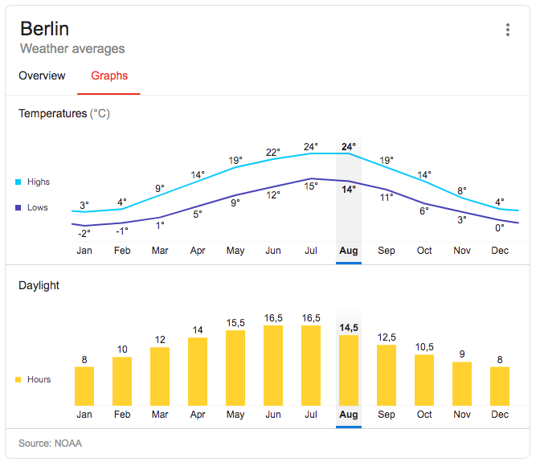

Deep within me, I yearn for variation. Very few things in life are truly monotonous, so when the weather actually is, it makes me sad. Most things like our heartbeats have a rhythm to it! So by that argument, I've been rather sad my whole life having lived in Singapore.

_Source: Google and NOAA_

The weather in Singapore is a straight line. If you google for "monthly weather in Singapore" you will see a straight lined graph for temperature and even sunrise and sunset. I've lived with this monotonous weather, day after day, month after month, year after year for 29 years.

I'm coming up on my first full year in Berlin where the weather varies with the seasons, meaning I have almost experienced my first full cycle of the seasons. I have to say, by the time I'm forced to think about going home, the variations that come with the seasons will probably be one of the hardest things to leave behind.

_Source: Google and NOAA_

Sure, there are practical things that may make me fed up. Like, it's possible for me to grow tired of having to re-outfit my wardrobe every 3 months eventually. And sure, some days I may prefer it to be less cold or hot than it actually is. *Man, I gotta wear all these layers to bring Brownie down to the courtyard to pee.*

But I like being pushed along by the force of weather, by something natural, to stay alive and thrive. When I don't have this force affecting everything around me, I commit the hubris of thinking that everything is under control, that no more progress is necessary, and that all that is left to do are the things that my heart desires. The lack of seasons in Singapore, together with our country's relative economic success, makes us think we are at the center of the world. When a problem comes up, what do we do? Our reflex is to _engineer our way out_ of it. That brings us yet further from the baseline.

We just haven't had to grapple with the changing seasons, that's why our heads have gotten so big. I'd love to see Singapore have an overseas territory in some place with seasons. I bet that over time, Singaporeans living there would be more humble, caring, and appreciative of the little things in life than those back in the mainland.

Viktor Frankl says in Man's Search for Meaning that between stimuli and response there is a space, and in that space is freedom that nobody but you can access. Perhaps because we are foremost biological beings then social beings, I prefer to be stimulated by things that are larger than human-made things. Like the weather; it feels nice to constantly be stimulated into that free space by the cold to think about a response, while it feels somehow like an error to think about and respond to human events.

In the end I would, like most things, prefer there to be a balance. But in Singapore, I was almost exclusively responding to human-originated stimuli and I feel out of touch with what I really am: a creature of nature. I'll take every reminder there is of that simple truth so I can live more in my place.