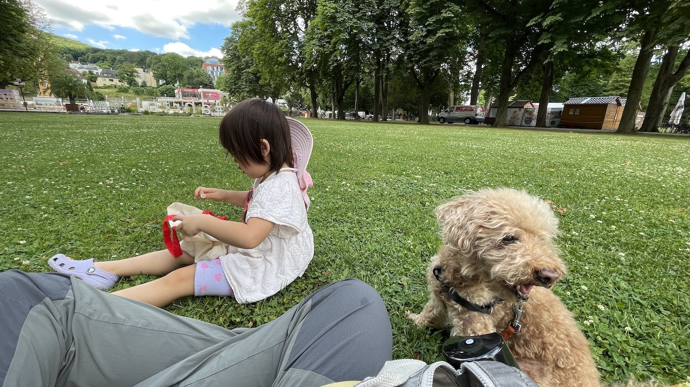
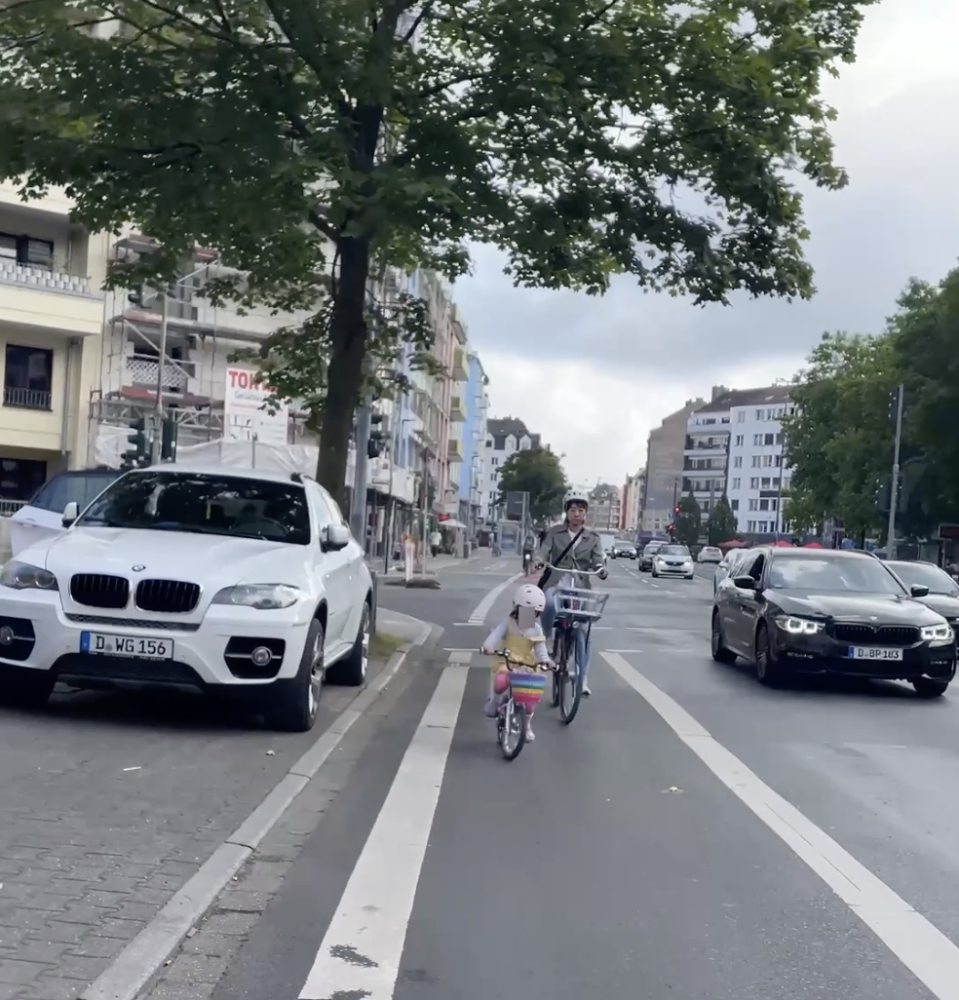

This has been a year to remember.

Our daughter has grown one year older. We made it around the sun without injury. I've secured my stay in Germany and quit my job to pursue an AI-assisted solo founder journey.

In this annual review, as is tradition by now, I go through the year to understand:

- What went well
- What didn't go so well
- What I learned

You can find my reviews from yesteryears here: [2017](/annual-review-2017/), [2018](/annual-review-2018/), [2019](/annual-review-2019/), [2020](/annual-review-2020/), [2021](/annual-review-2021/), and [2023](/annual-review-2023/).

Let's dig in.

## What went well this year?

**Made the decision to quit my job.** I knew this was coming and had simply been waiting for my permanent residency in Germany to be approved to pull the trigger.

I received my final pay check in July and went solo, meaning that I'm now the developer, designer, product owner, marketer for some kind of business that sells some kind of software. In 2026 I'll work to make that clearer.

I was aiming for 1k euros MRR by now, but because I chose to take _Arbeitslosengeld_ (unemployment money) – which I learned about only AFTER I quit – I'm doing the *Arbeitssuchend* (job seeking) thing, which includes attending a full-time German language course. And that screwed up my original timeline.

Nevertheless, this is a _good_ thing that happened this year, because I felt that I needed to come back to entrepreneurship some day, and I'm glad I had the courage to take the leap after almost 10 years of receiving increasingly larger salaries as a software engineer. Scratching an itch big time.

**Speaking German more confidently**. This year I attended 3 months of a full-time German language course (2 months more next year) and am proud to say that I can now speak roughly at the B2 level (it goes A1, A2, B1, then B2).

This is already paying dividends as it unlocks a greater quality of life in Germany.

Just yesterday, for example, a man approached me, explaining in German that he needed coins for a ride and wanted to change his paper cash with my coins, if I had any please? I'm pleased to say that not only did I understand him on first-hearing, I also replied him effortlessly in German. We both smiled as we said bye, but for very different reasons.

_Wenn man in Deutschland leben, muss man deutsch lernen and gut sprechen._

**Started cycling as a family.** Our daughter learned to cycle this year, so we got ourselves rental bikes to go cycling with her.

We also unwittingly started doing more things with our bikes. From August till the end of the year, I'd been cycling every weekday to my German language class. And I've been cycling to the gym every other morning.

I count this as something that "went well" because our bicycles have provided us with good memories, some exercise, and a lot of utility.

**I hit the gym 115 times this year**. That's 2.4 times a week on average and is a personal record in consistency.

To pull off this gym routine, in October I changed gyms to one that is open 24/7 with self-service entry and have been entering the gym on most days at 6am and leaving at 7am, before my family is awake.

For the record, this includes a 2.5 month hiatus. More on this later under what didn't go so well this year.

Next year, I'd like to average 4 times per week for the whole year (208 times).

**Sticking to my own work hours.** I've been stopping work at 4:30pm everyday since I quit my job and went solo.

This is a rule I'd like to keep for the new year, because my daughter is released from kindergarten at around that time and I want to spend some time with her everyday.

Not a single cell in me doubts that spending time with my daughter in her early years is a good decision, so I'm doubling down on it, even if "clocking out at 4:30pm" sounds like something reserved for those who have "made it" financially (and me being far from that with 0 revenue).

One final note on this topic: as I strike out on my own, I keep coming back to the notion that "if I can't do it when I have no customers, I won't do it ever."

What I mean is that I believe I need to already live the lifestyle I hope to live as a solo business owner, rather than wait until I've hit success to live it, because this is the **least complex state** of being a business owner there is. After this comes taxes, accounting, customer support, bug fixes, and so on.

**Seasonal farm visits**. The highlight of our nature escapades this year has been to pluck cherries in a farm in the region (Apfelparadies, Mörs) in late June. The cherries oozed deep red juice and were abundant. I insist on going back again next year and the years after.

**Invested in good tools**. Buying the most expensive computer I've ever owned: Mac Studio M4 Max.

The price tag of 2280 EUR is worth it, as I'm developing apps full-time now and it has helped reduce iOS app build times to under 10 seconds. For comparison, my MacBook Air builds the same project in around 30 seconds. Since "build and run" is something you'd need to do very often as an iOS developer, this is a huge time saver.

In terms of other tools, I also paid 38 EUR for an annual subscription to Day One journaling app, which made it both possible and fun to write this annual review! Too bad I only got it in June. Next year will be my first whole year using it, and I can't wait to review the year already.

I also paid 300\+ EUR for Lenny's Product Pass. Loads of tools I use on a daily basis, so it's well worth the investment. My absolute favourite tool in the set has been Wispr Flow, which allows you to dictate with 95% accuracy on laptops and mobile, all despite me having a hard-to-place Singaporean English accent. The other honourable mentions:

- **Devin** AI software engineer. Really good for firing off instances of AI to tackle well-scoped tasks without supervision
- **Perplexity** for search and planning. I no longer google for information, I perplexity it. I can put up with the occasional bugginess of their desktop app since it's so fast and accurate in gathering information for me
- **Replit** AI agent. Really good performance until they went crazy with the pricing for normal people. Simple tasks started costing $1, which is fine if I'm up there among the top freelancers or business owners, but completely unaffordable as a bootstrapped founder IMO.
- **Bolt** and **Lovable** vibe coding tools. To me, these are good only for prototyping web apps quickly. They are bolting on their own backends to provide a complete out of the box experience, which might change the game, so I'll casually keep an eye on them. But I'm still not ready to give up software engineering principles and thought processes, so these remain just toys to me.

**Gave up coffee for 7 months and 16 days.** I was feeling anxiety in social situations in a way I never did, and I thought this was the cure.

I had mild pressure headaches for a week or so, then they were gone.

Did it fix my anxiety? No, but it did reduce it slightly.

I paid a lot of attention to myself this year to figure out why I had suddenly developed anxiety and my new hypothesis is that my socialising muscles have simply atrophied since COVID, because that's when I started to work fully remotely and never went back to the office regularly.

Once that hypothesis seemed more and more plausible, I decided to go back to drinking coffee again. Figured I could do with the mental and spiritual boost as a solo founder.

I'm happy. I look forward to my afternoon cup of coffee everyday and would argue that there's tremendous value in letting yourself indulge in things whenever you can (I consider coffee mostly a harmless drug).

## What didn't go so well this year?

**Still can't say for sure where we'll live long-term**. Spontaneously had multiple serious conversations about staying in Germany or moving some place else.

Places we considered:

- Singapore - home
- London - energetic but too expensive
- Amsterdam - beautiful but no other compelling reason, especially as we speak better German now than before
- Somewhere in New Zealand - do we love nature enough to be surrounded by it 24/7? As city folks, we're not sure. For me, [Derek Sivers](https://sive.rs/nz0) is an inspiration

Tentative conclusion for the year: stay in Düsseldorf because all of us love it here. There's just no reason to leave, even if another place might bring us more adventures and _potentially_ be better for us as a young family.

**Not making money as a solo founder yet.** As part of my going solo, I've poured myself into 3 different projects so far, none of which generated any revenue or gained any significant traction:

1. Descript alternative "TrimScirbe" – prototype stage, gave up because I was convinced that text-based editing sounded better than it actually worked in practice
2. YouTube [channel](https://www.youtube.com/@NickAngHD) "Moved Show" – I interviewed more than 10 people and published 12 long-form videos. Disappointed with growth and gave up. I reflected on this on [LinkedIn](https://www.linkedin.com/posts/nickangtc_how-are-things-going-after-i-quit-my-job-activity-7404761894965837824-0ay_)
3. [Youtionary](https://youtionary.com) – ChatGPT meets Duolingo for language learning (iOS \+ web apps). Been working on this for around 3 months, expected launch in January 2026

**Skin problems.** I've suddenly developed isolated patches of thick, flaky skin that I waited too long to get a medical opinion on. They are worsening and still haven't been properly diagnosed.

For months I also had what I thought was a simple haemorrhoid, but I procrastinated out of embarrassment to see a doctor about it. I don't particularly relish the idea of having someone look up my ass. But the cream my doctor eventually prescribed was the only thing that relieved me of that problem. Don't be stupid! See a doctor!

I will bring this problem into the new year with a few visits to the dermatologist.

**Trading in workout time for work for a few months.** I chose to swap morning personal development time with building time and regret it.

My journal entry speaks volumes of my mentality at the time of this decision: "I should use my morning reading time and swap it for now with building time. That could be 1.5 hours every morning extra. It'll count. Currently working 930-12 and 1-4 each day. With this new setup it'll be 5-630 on top of those. So that's 2.5 \+ 3 \+ 1.5 = 7 hours instead of 5.5 hours."

Time blurs memories. I actually thought that I made this decision after I started 4 hour daily German classes, so I was surprised to learn from my journal entries that I made this decision BEFORE I was preoccupied with German classes.

I should have kept morning time reserved for personal development, whether that be reading, writing, or going to the gym. I've written about my 'miracle morning' practice in a [recent post](https://nickang.com/coming-back-to-miracle-mornings/).

## What did I learn this year?

**Don't work before bed**. Attempting to be do something productive (work) before bedtime ends in disaster 80 percent of the time for me, because if I don't finish what I intended before it's time to sleep, I'll get poor sleep. The brain stays active instead of shutting down.

I've learned that it's more optimal to do something light and unrelated to work to ramp down the brain to land onto the tarmac of sleep gently. These days that's reading or writing a journal entry.

**How to title journal entries**. I should have started every single Day One journal entry with a clear title. It makes reviewing 10x easier. It's also good practice for a marketer. A few titles I liked:

- You won't want to forget this trick to get people to read what you have to say
- I have to improve on this thing if I want to be heard
- Make this app, sell for 9.99 euros per download

I admit, it sounds a little sad to have to trick yourself into reading your own journal entries. Maybe it is, but I do find it helpful when parsing my 892 entries with more ease for this annual review. What's easier tends to get done.

**Don't cheap out on your time.** Take the option that gives you the best chance in maximising your potential, not the one that costs the least. In my opinion, this is an important skill for solo founders. Wrote an example of this in action in a [LinkedIn post](https://www.linkedin.com/feed/update/urn:li:activity:7349339041626005505).

**Know yourself part 1.** Home team or A-team? I know someone who wants to work in an A-team, to be surrounded by brilliant, hardworking software engineers.

I also know someone who just wants to clock in and out of work, doing the bare minimum to earn their salary. The "Do your work, get paid, come home" mindset.

Put them together in the same room and you'll see conflict. In fact, an A-teamer teared up on a call with me when he realised he has joined a home team, which he originally thought of as an A-team.

I've been both of these myself.

The learning here is that the most important thing is knowing yourself. Anything that helps you in that endeavour is useful. Because in the end, neither of these approaches is wrong.

I already knew this, but am taking heed for the new year, hopefully so that nobody gets to dictate what is best for me. For the record, in 2025, I'm home team.

**Know yourself part 2.** People like [Hank Green](https://youtu.be/f_Rqf-vxBM8?t=335) – prolific YouTuber, author, and recently app creator – "fall downhill," not swim upstream, and still get a shit ton done. This means doing the easiest thing at any time rather than doing what he feels he should. Once again, the important thing is to know yourself.

**Radical incrementalism.** I've learned that this is a decent response to the hustle culture among entrepreneurs.

Radical incrementalism means to work a bit then leaver for the next day and come back again. It's working sustainably. It's saying OK I'm done for the day and truly moving on to the next part of the day, knowing that this very decision will fuel your next day's work.

**Your first business is not a business, it's personal development**. Heard it from a YouTube video. I agree 100%, maybe because it gives me permission to fail?

**Always prioritise physical activity.** It's a good policy to let exercise precede productivity in any given day. Good physical fitness leads to better mental acuity, and both amplify the output of knowledge work.

**Time is all children need from us.** I was in Neuenahr one summer day with my daughter. We're sitting in a random field and as soon as we sat down, she starts collecting daisies and grass into her tote bag. Then she launches into full 'cooking' play. She cooked and I sampled her cooking. We did this for 1.5 hours and went to get ice cream. That was a wonderful day.

By contrast, we were once at a bouldering gym and a 6 or 7 year old girl kept making eye contact with me. Whenever I noticed her, she would let out a weak smile and coyly wave at me. Later, I noticed that her dad was busy climbing routes in the gym, not paying much attention to his daughter.

Is it a surprise that children just want time from us? I don't need to read social science papers to know this is a fact. It's like that sticker I once got from a pet association: "To you, he's a dog. To him, you are everything."

Parents are young children's entire world, and the currency in that world is time. Time to talk about feelings, answer questions, come up with questions, construct things, succeed and fail together.

This year I doubled-down on this belief and it paid off. Wife and I are happy with how our daughter is continuing to grow up curious, joyful, creative, communicative, and fearless. More of the same next year.

## What were the most memorable moments this year?

This one's a bonus section I thought would be fun to add to this year's annual review.

My daughter...

- Learning to ride the bicycle within an hour (with months of riding a balance bike prior)
- Taking her maiden road ride on the roads of Düsseldorf
- Getting stung by a wasp for the first time
- Noticing the difference in American and British pronunciation from the word "can't"
- Shedding happy tears for the first time as my wife and I walked into her room with a birthday cake and candles on the morning of her birthday
- Going through a phase of wearing dresses as skirts, because her skirts were colourful
- Getting kissed unexpectedly by Minnie Mouse in Disneyland in a crowd of hundreds
- Seeing death unfolding in real time when a pigeon fell from the sky next to us, hitting the ground, spasming for a few seconds, and becoming lifeless
- Playing the G7 chord (a 3-finger chord) on the ukulele for the first time
- Performing the ukulele for the first time in front of a group of 5 people - it was the song "You are my sunshine"
- Making her first pun while we were playing cards: "I win!" ... "eye win! Get it, daddy? Eye win" (pointing at her eye)
- Wearing a ballet outfit for the first time
- Making her first book and filling it with drawings
- Saying "who first going to put on sleeping clothes has", mixing German grammatical structure with English

_Maiden road ride of our daughter, on the roads of Düsseldorf_

Me...

- Pulling out my first white nose hair
- Grabbing a large butterfly that was trapped in a hotel breakfast room, bringing it out to the street, and my daughter asking to take it in her hand to let it go. It flew away
- Watching the entire Star Wars line-up of movies and The Mandalorian for the first time. This is the way. I have spoken
- Truly understanding 'speed is a feature' from hearing the news of entrepreneur Maor Shlomo building and selling Base44 to Wix for $80 million in under 1 year
- Selling my camper van, getting rid of a burden that a few years ago was an asset (bought at 68k, sold at 40k, after 3.5 years of ownership)
- Going back to school for the first time in almost 10 years (German language classes, 8:30am to 12:45pm every weekday for 5 months)
- Receiving a phone call from my daughter for the first time
- Pitching and getting the chance to transition to a product manger role from a software engineer role at the last startup I worked at
- Getting emotional and proud watching the [National Day Parade](https://www.youtube.com/watch?v=u1RxF6f4qyk) in my bedroom in Düsseldorf
