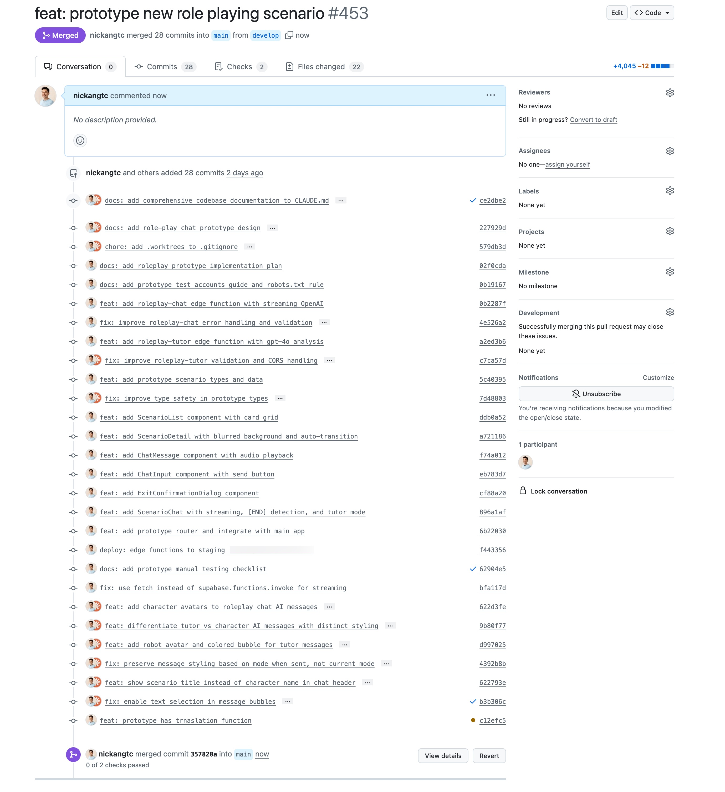

New year, new Claude plan?

In this article, I'll explain why I've jumped _back_ over to the really expensive Max plan for Claude.

Standing at 100 EUR per month after VAT, it's the most expensive subscription I've ever paid for, and likely to continue paying for many months this year. That's worth interrogating.

## What is Claude code?

First, what's Claude Code?

If I were being cheeky, I'd simply answer, "it's magic." Because it's close!

For a software engineer who has been coding professional by own hands for almost 7 years before ChatGPT was released, I know just how tedious and difficult it is to produce good, relatively bug-free, working software.

Claude Code is a command line interface program that lets provides Claude – Anthropic's cutting edge foundation AI model – your computer as its workbench. What this means is:

- Claude Code can access your filesystem from the command line
- (Command line is a toolset that has been refined over decades, so it's jam-packed with ultra-optimised, highly useful commands built into your computer, for searching and manipulating files and contents)
- Claude Code can code like a human programmer for the first time, not just because it has similar intelligence (with a mid-level engineer at time of writing) but also because it can use tools for the first time like one

The workflow with Claude Code is simple:

1. Open Terminal and navigate the the folder that you want it to work within
2. Launch Claude with `claude`
3. Start telling it to do things and it will write code, essays, poems, read files to gain context to make surgical or wide-ranging edits to achieve new outcomes you specify

With this magic, I can achieve feats like this in a single 1.5 hour coding session:

## Hitting limits regularly

Back to being a software engineer and suddenly discovering this tool and how I've changed since.

I don't write code anymore. Almost literally nothing is written by me in my newest projects, including [Youtionary](https://youtionary.com), an iOS language learning app written in Swift.

I don't even know Swift. To build Youtionary, I just spent 1 hour reading up on the Swift programming language and 2 hours reading and watching videos about SwiftUI, the framework for building apps across the Apple ecosystem.

From there, I have solid basis to be a product manager and "tech lead" to Claude Code, telling it in rich-enough detail to write the code to build the features that I want.

Like any company, Anthropic needs to make money. They know they have a good product because engineers and product managers plugged into the tech scene have been giving it a solid two thumbs up. So they introduced usage limits to ~~prevent abuse~~ make money, understandably.

The 5-hour usage limit works like this:

- Your first message to Claude/Claude Code starts the countdown of a new 5-hour usage window
- You have a set amount of tokens allocated to that window depending on your Claude plan (Pro, Max 5x, Max 20x)
- You either finish the tokens within the 5-hour window first, or you don't
- If you don't, happy days, you can keep going
- If you do, you're fucked. You can either stop coding or switch back to coding by hand (which for me is at least 10x slower than having AI do it at this point in our march to AGI), or pay per token at API billing rates (more on this later)
- Now you have to wait until the 5-hour window ends to start a new 5-hour window

**There's a subtle weekly limit too, which I have also hit**, despite being a good dog awaiting my new 5-hour window eagerly.

Since my guiding word of 2026 is [strike](/word-2026/), I decided to chew my leash, pay the price (20 € → 100 € monthly bill), and run wild with Claude Code on the Max plan.

## It's like a buffet

Using Claude on Max vs Pro is the difference between a buffet and a meal in a restaurant. You pay more, but you pay a fixed price for all-you-can-eat.

Since I'm currently [having a big appetite (building apps)](/annual-review-2025/), ordering à la carte is too expensive.

It costs $3/MTok input, $15/MTok output for Sonnet 4.5. You can forget about using their top of the line model Opus 4.5, which is $15/MTok input, $75/MTok output. That's just plain ridiculous.

I've tried à la carte – the tokens get burned too quickly once I went past the usage limit in a 5-hour window. It added up so quickly that I found myself stopping usage and moving on to something else, which wasn't always what I wanted.

There is a psychological switch that turns off when you know you've paid the entrance fee. You go from being conservative about using Claude Code to being on the offence, using it as much as possible in your work session.

I found I could never toggle on that switch when I was on the Pro plan \+ pay-per-token via the API.

This was the realisation that made me jump over the fence back to Max.
