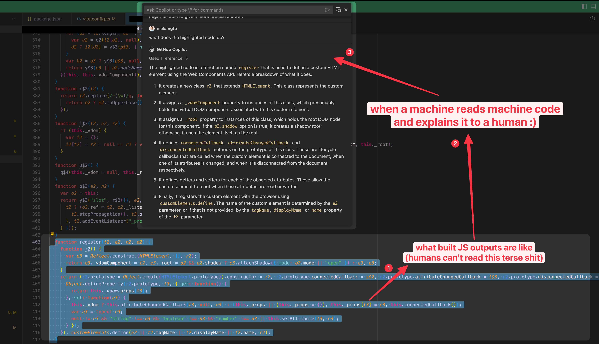

Everything here is based on my direct experience of successfully using AI to assist me in my day-to-day work and life. Each header is a situation where it worked.

AI tools included in this list: ChatGPT (GPT-4) and GitHub Copilot.

## GH Copilot explaining build code

Code that's gone through some kind of build pipeline usually comes out obfuscated. This can happen even if you configured Vite or Webpack to not minify the output, because often they rely on already-minified third party packages that need to be bundled into a single file.

But sometimes you just need to read code post-build to verify that something is in it, or to study how it'll work on the client side (e.g. is it going to pollute the global namespace? Would it conflict in any other way with the rest of the client-side JavaScript?). That's when Copilot came in handy for me.

## Figuring out why two SVGs look slightly different

Paste the 2 SVG code into ChatGPT and ask,

> I see that the second SVG is rendered smaller on a browser than the first. I verified that the parent elements both apply the same styles, so I suspect it's the SVG code itself. Help me spot the difference.
