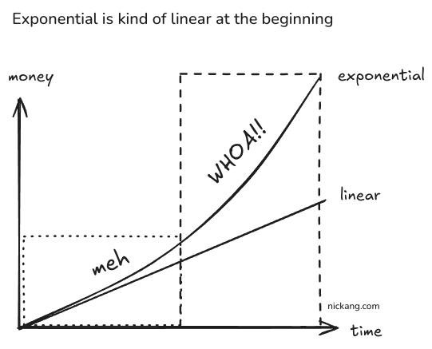
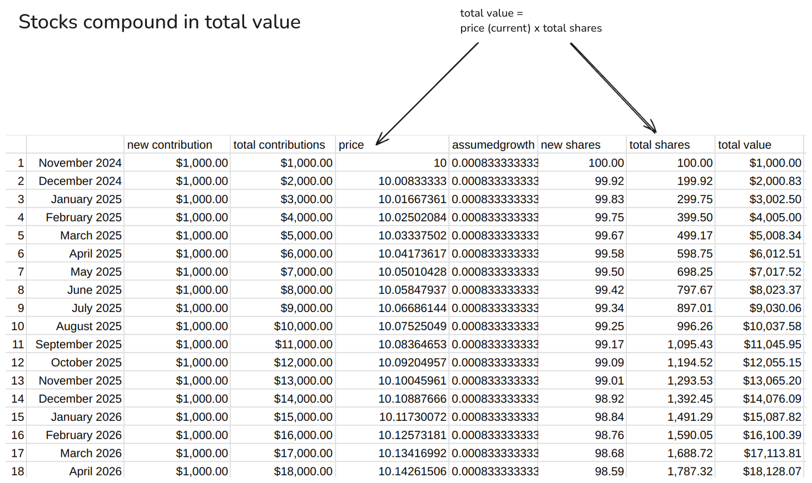
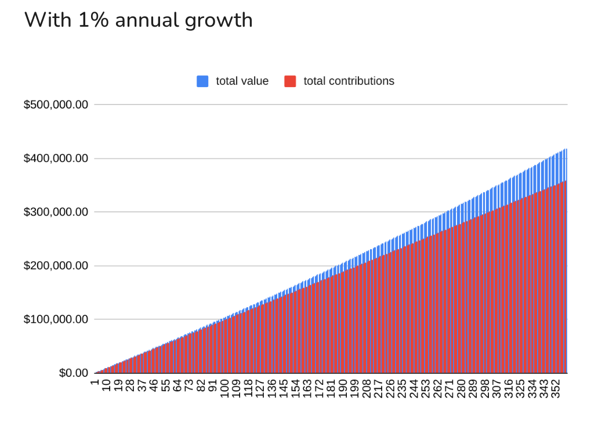
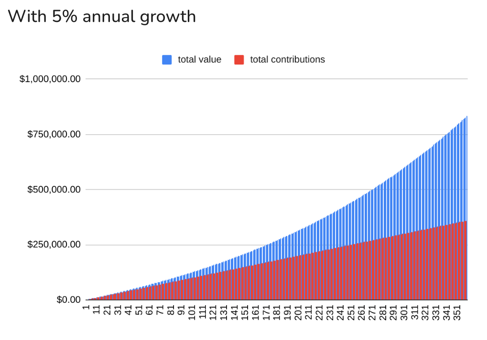

Cash in the bank compounds in interest. Stocks in an account compound in... what exactly?

As I begin my investment journey in earnest at the age of 34, one thing that stumped me was how stocks could compound over time. I mean, what compounds?

The typical example we got from school was money in the bank, which accrued interest. That example has helped me grasp the concept of compounding interest:

- You have $1000 now and put it in a bank.
- The bank rewards you with interest of 1% per year for saving with them.
- After year 1, you have 101% of $1000.
- After year 2, you have 101% of 101% of $1000 (instead of just another 101% of $1000).
- After year 3, you have 101% of 101% of 101% of $1000 (instead of just another 101% of $1000).

This is intuitive because we can see interest credited into our bank. It's easy to see that the next year's interest will be calculated on the new balance, which includes last year's interest.

From this, I understood that even though the interest rate remains unchanged at 1% per year, my bank balance will grow exponentially because the 1% applies to the new balance every year.

As a side topic, from plotting this out on a Google Sheet, I also understood that exponential sounds very nice, but in most cases, the beginning of the exponential curve is not very different from linear at the start.

_We're not likely to see this happening at 1% interest, or at least we won't be alive to see it enter the WHOA!! phase._

Okay, but back to how intuitive interest is because it accrues in our bank statement.

For cash in the bank, we have our bank statement helping us understand that next year's interest will apply to the new balance in our account, thereby compounding the growth.

But stocks don't pay interest, which means no new money (in the form of more stocks) is being credited into our stock holdings account.

So how does compounding work with stocks? Or does it not work at all?

This was the question that baffled me all evening—or, if I'm being honest, for years before I sat down with a spreadsheet—but I think I've figured it out now.

The key is to track the total value of your portfolio at each step. Then the compounding will reveal itself.

In the following table, you'll see this in the column "total value," which is (price x total shares):

Maybe a step-by-step explanation will help even more:

- You buy $1000 worth of a stock. The stock is priced at $10. This means you own 100 shares of the stock.
- Next month, you buy another $1000. You've automated this. This time, the price is NOT the same—it has increased by a tiny fraction.
- (Interlude: Why assume the stock will increase by a "tiny fraction"? Because it's safe to assume that we'd be able to invest in a safe stock (like an ETF) with a historical record of growing 1% on average in value each year. That fraction 0.00083 is derived from 1% divided by 12 months.)
- So in this new month, your $1000 buys you 99.92 new shares (not 100).
- A new month, your $1000 buys you 99.83 new shares. Then it gradually decreases in number...
- ... but **because the price has increased by a "tiny fraction" each month, so has the total value of your shares.**

And with time, the effect of compounding growth with a stock portfolio becomes obvious:

- By month 3, the total value of the portfolio is not $3000, but $3002.
- By month 12, $12,000 becomes $12,055 (+$55).
- By year 10, $120k becomes $126.1k (+$6,100).
- By year 20, $240k becomes $265.5k (+$25,500).
- By year 30, $360k becomes $419.6k (+$59,600).

Of course, I couldn't resist plotting this table as a chart, so here is this growth visualized:

_A bit different from the exponential curve we imagined though..._

That's a 30-year horizon of compounding a stock that you buy every month with the same amount of money ($1,000), with the stock assumed to have an overly conservative 1% annual growth.

The S&P 500 has grown around 10% annually on average over the last 100 years. Yes, past performance should not be used to imagine guaranteed future results, but it's an indicator, so let's go with 5% annual growth and see what the curve looks like now.

Same monthly amount invested, same time horizon, but 5% growth instead of 1%:

_Much better._

Much better.

Yes, it feels like we're pooping rainbow candies at this point, but I think we've learned two things:

1. When it comes to cash, interest (more money in the bank) is how the money compounds. When it comes to stocks, the total value of the shares you own is the thing that is compounding because we can safely assume share prices go up in the long run (30+ years).
2. Compounding at 1% feels almost linear. Compounding at 5% feels exponential.

## Time in the Market Wins

There's apparently a popular saying in investment circles:

> Time in the market beats timing the market.

I learned that this is true from this exercise. Wanna know how?

I changed the stock price in my spreadsheet. Instead of the price per share being $10 at the start, I changed it to $100. Then to $1,000 (meaning I'd buy just 1 share per month with my $1,000 monthly contribution). Can you guess what that did to the chart?

Absolutely nothing. IT REMAINS IDENTICAL.

I paused for a while, re-created the visualization in Google Sheets, just to be sure this was right. And it is. How, though?

Zapping a few brain cells, I finally understood. The price of the stock doesn't matter because we're assuming a **fixed percentage growth** in stock price per month, which we can quite safely do because we intend to buy and hold for 30 years in this example. Over a long time period, the actual stock price per month will fluctuate, go through booms and busts, but will grow right and upwards overall. We simplified all that complexity by assuming a fixed percentage growth per month.

Is this simplification warranted? Yes, the S&P 500 has grown around 10% annually **on average** over the last 100 years. But apparently, if we sliced it in different 10-year periods, the average returns can vary wildly from over 100% (1970s) to almost 0% (1950s). There's a lot more data I'm going to have to dig into to find broad patterns.

For now, I'm just glad I understand how stocks compound over time and how powerful that compounding can be. It'll be the basis for setting up my retirement fund.
