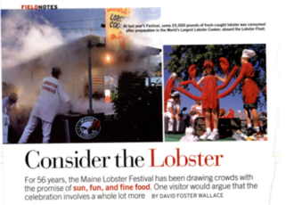

Lobsters can feel pain. It's not known if the pain it feels is as intense or less than what humans feel, say, in a pot of boiling water.

Lobsters used to be cheap food because they were incredibly abundant. To the point that some places forbade feeding prison inmates lobster too often, likening it to feeding them with cooked rats.

People transitioned to eating lobsters more and pushing it more up-market when someone discovered, and then spread, the brilliant idea of cooking them fresh. As in, one moment they're alive, and some excruciating amount of time later (to the lobster), they're dead and ready to eat.

It takes something around 30 to 45 seconds for a lobster to be boiled alive until it is boiled dead.

Lobsters absolutely thrash about in a pot of boiling water. They exhibit a "preference" to not be boiled, which looks like any number of sane things like frantically trying to claw its way out, or clinging on to the rim of the pot they are being boiled in.

The lobster festival in Maine is basically a tourist trap built atop the death of thousands of lobsters.

Lobsters existed in the Jurassic period, making them much, much older a species than humans.

Lobsters can live up to 100 years if we don't harvest them from the seabed.

I'm never eating a lobster again.

---

https://www.columbia.edu/~col8/lobsterarticle.pdf

I'm currently working through David Foster Wallace's writing, starting with the ones available for free. [Open Culture](https://www.openculture.com/2012/02/23_free_essays_stories_by_david_foster_wallace_available_on_the_web.html) has a list of those.
