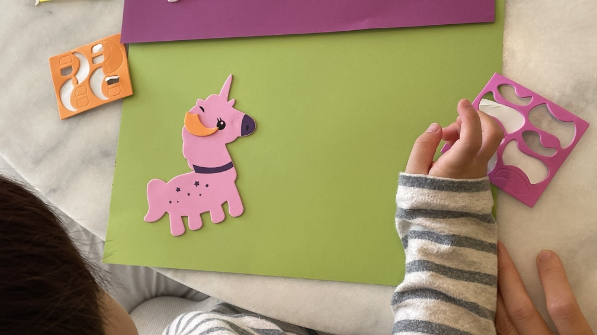

My daughter did some pasting handicraft recently and it involved a couple of unicorn stickers.

She pastes one of the on a piece of paper but realises, too late, that it was a little slanted.

Of course, being three, she doesn't know it's too late, so she tries to peel it off. To correct its angle relative to the landscape page.

She fails, though. Sticky tape sticks too well to paper, I notice her coming to the realisation.

What happens next is fascinating.

She presses the rest of the unicorn down, firmly sticking to its position. She then comes off her chair and explains, "this unicorn is jumping." She then twists her body and jumps off the ground, proclaiming, "like this!"

"That's why it's like this," she says, pointing to the unicorn.

I imagine this is what a large part of creativity involves. (I wouldn't know because I'm not doing much creative work.)

But I'm thinking about scriptwriters for TV series. When they realise that the unicorn of a character has been stuck firmly onto the page in a certain way, and a new story needs to be invented to explain an unintended slant.
