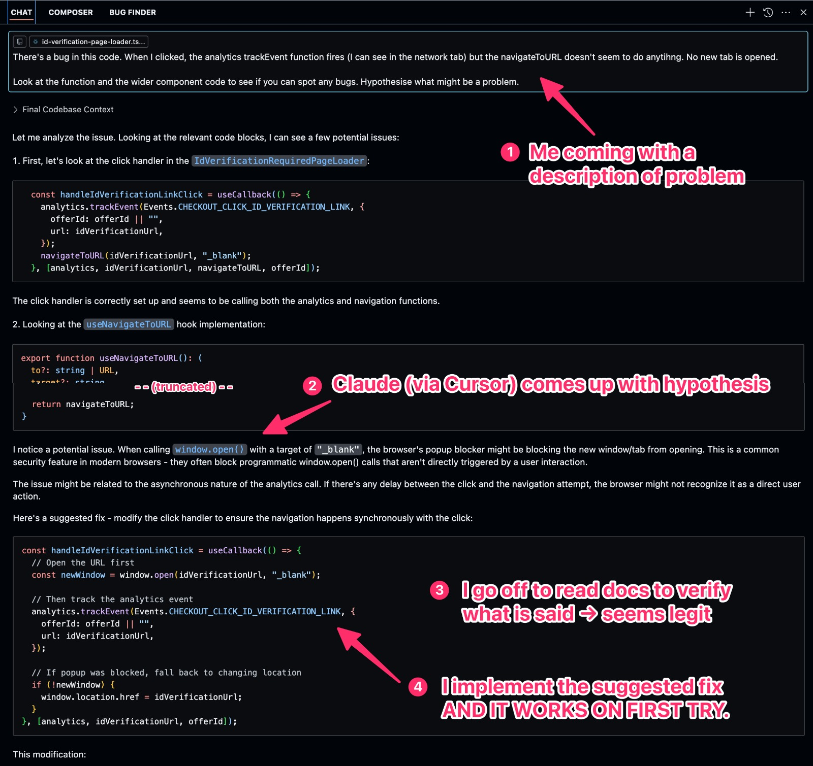

## AI - When a custom GPT is not going to be useful

I spent about an hour creating a custom GPT on ChatGPT this morning. Now that I'm writing a daily reflection, I thought a custom GPT could help in some way. It didn't.

My idea was to click a button and have the LLM ask me a series of questions to check-in on my day and, I suppose, tease out the things that I've noticed and learned in the day. Sounds like a great idea, right? But it quickly got tiresome for me. It felt like I was being interrogated and the thing sucked the fun out of reflections.

Answering questions -- not surpirsingly -- didn't feel anything like a session of deep reflection. I chose my words less carefully, hoping to move on to the next question.

What I learned from this exercise was that custom GPTs must do more than just summarise your answers. They're probably 10x or 100x more helpful when some kind of calculation or information synthesis (e.g. predictions) is being made with your inputs.

## AI - Remarkable result with Cursor

Today my team noticed a bug in the final step of our hosted checkout product. Since it's potentially causing revenue loss, and because I happen to be free, I investigated it immediately.

With the help of Cursor (with a paid subscription), I was able to debug the problem in 1 minute instead of the traditional 30 minutes.

What I did: I opened the file that I believe is the source of the bug, and simply prompted it -

```
There's a bug in this code. When I clicked, the analytics trackEvent function fires (I can see in the network tab) but the navigateToURL doesn't seem to do anytihng. No new tab is opened.

Look at the function and the wider component code to see if you can spot any bugs. Hypothesise what might be a problem.
```

It looked at the code and came up with a hypothesis as I asked. I saw the answer and wasn't sure if it's true, but knew I had to (and could easily) verify it myself. I actually opened up ChatGPT, pasted the hypothesis from Cursor (Claude), and asked it to cross-check its validity. When that came back positive, I knew it was likely accurate.

The next step on my part was to read the docs (MDN) to understand the technical details of the problem. It sounded legit, so I implemented a solution, which Cursor sugggested (!!), and it worked on first try.

This is what that minute looked like, where I prompted, it replied, I verified, and I implemented something:



## Technical - TIL: transient activation needed for opening new tabs

We had a bug (the one mentioned above, solved by AI) whose root cause helped me learn something I didn't know before about web APIs.

The bug was that a new tab didn't open with a particular URL when a user clicks a button that should have done that.

Turns out, when we use JS to programmatically open a new tab in a browser, we need to make that actual `window.open()` call as soon as possible after the user has clicked the button.

This is one of many [features gated by user activation](https://developer.mozilla.org/en-US/docs/Web/Security/User_activation). When a user activation has occurred (e.g. clicking a button), a timeout starts. Actions like opening a new tab with a URL must happen within that very short timeout window. If it doesn't, well, the browser just blocks that action. As far as I could tell, there are no warnings.

There's transient activation, then there's sticky activation. Transient means that there's a timeout involved, and if the Web API hasn't been fired, then it loses that chance. Sticky means that there isn't a timeout once activated, meaning a user's interaction unlocks a whole set of Web APIs for the duration of the session.

## Productivity - What's faster than the address bar for loading a website?

I need to open GitHub repositories very often in my line of work. So far, how I've been doing that is by Cmd + L in Chrome and typing something and hitting enter.

For example, I have a repository called infra-app. To load this repo, I'd type "infra" and hit enter without looking at which URL in my browser history was matched. The hit-rate is about 50-50. Half the time, I'd be loading an old PR, which meant I was now 1 click away from the repo's main page. So I'd click the repo title, which navigates to the main page.

This is fine until you stop to notice how much cumulative time this wastes.

I load GitHub repos on average about 5-10 times a day. The delays per miss adds up:

- click on Chrome to activate the application window
- enter part of URL and hit enter blindly
- wrong page is loaded
- click to the right page
- right page is loaded

Today, I finally found a simple solution to this - using the free macOS app, [Alfred](https://www.alfredapp.com/). I added the full URL of the repo as a saved command with a keyword, so the way I'd load the infra-app repo has 2 fewer steps:

- cmd + space to summon the Alfred command palette
- type "infra" and hit enter blindly
- right page is loaded

Now my hit rate has gone up to 100%. It's such an easy thing to setup that I feel rather silly not having thought of doing it earlier.
