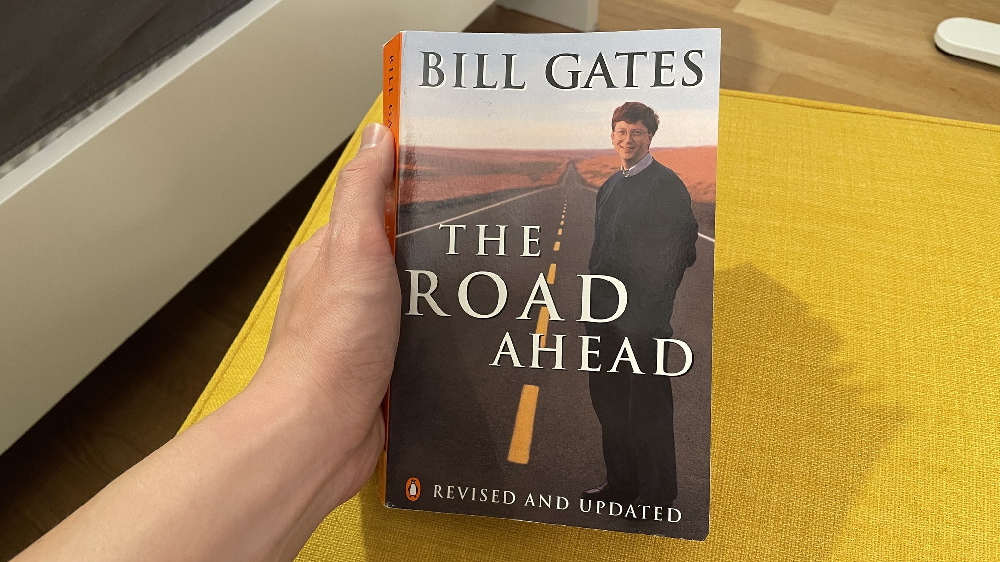
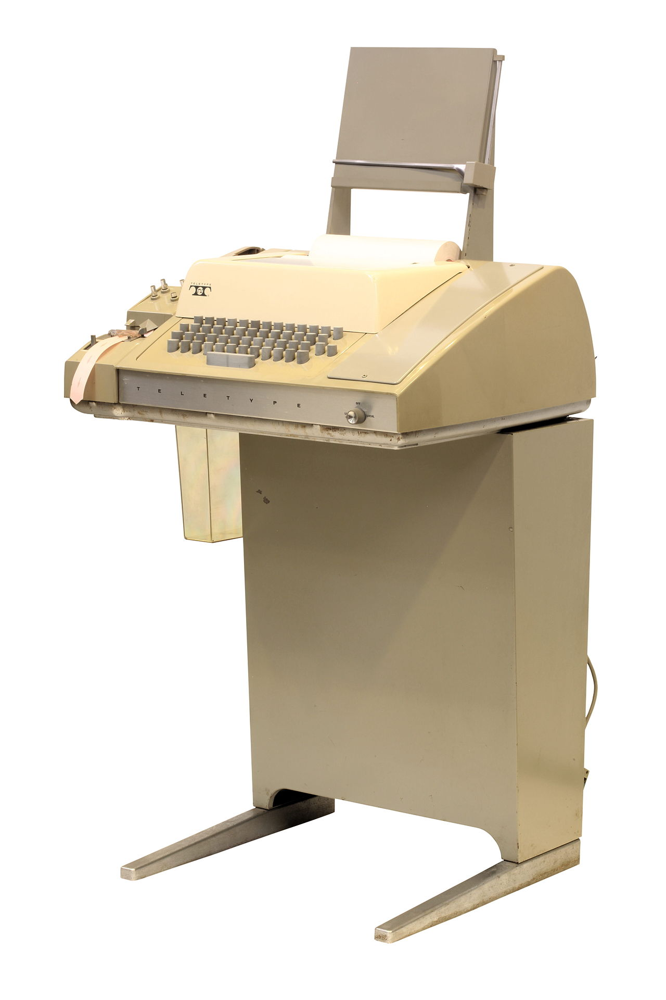

I just started reading The Road Ahead by Bill Gates, a book published in 1995.

I have it on my shelf because of Alex Danco's newsletter and feel like he's right to recommend reading more source material. I'm reading it now because I'm curious to learn more about the history of the computer and software industry as I try and navigate my place after almost 10 years in the industry.

## Some poignant quotes

This reflection by Bill Gates about computers from 1995 is why I like my profession as a software engineer:

> Computers are great because you get instant feedback and you know right away whether your program works. That's not something found in many other activities.

I've read journalists talk about us living in a world mediated by social media and our phones, which makes this sound prescient of Bill Gates in his book:

> Our tools mediate our lives. Think about the wheel and the plow, the crane and the bulldozer. Then think about how the PC mediated work life. Information tools like the PC and internet amplify intellect rather than muscle.

Of particular relevance now in the Age of AI:

> One thing is clear: We don't have the option of turning away from the future. No one gets to vote on whether technology is going to change our lives. No one can stop productive change in the long run because the marketplace inexorably embraces it.

## Putting computers into perspective

When Bill Gates was in Lakeside High School, people bought computer time instead of computers. And back then, he had to pay $40 for an hour to access a time-shared computer using a Teletype.

If you're like me, you've never heard of Teletype. It's apparently an electromechanical teleprinter designed for light-duty office use. A Teletype (Model 33) looks like this:

It's a beautiful thing to hear Bill Gates explain how the need to pay for this computer time was what drove him to the commercial side of the software business. Microsoft continues to have a large impact on global society with Windows and Copilot, almost 50 years later.

Back then, when new hardware was released (i.e. every new computer), you had to rewrite existing software to run on that hardware.

## The insight that led to the founding of Microsoft

Bill Gates and Paul Allen were buddies and avid computer hobbyists. They enjoyed using computer time to program games like Tic Tac Toe. As they went to university, they continued discussing computers.

One day in 1972, Paul shows Bill a specific article in an electronics magazine that they both read. It introduced Intel and its new product, the 8008 microprocessor. The general sentiment in the industry back then was that microprocessors are for doing one specific thing embedded in devices, like a traffic light or elevator. Nobody had thought to use it as a small computer. Computers were mainframes.

Bill and Paul were curious. They asked for a manual from Intel, and tried to figure out if they could squeeze a version of BASIC onto the 8008. They realised that they couldn't.

But two years later in 1974, an article in the same magazine brought Intel's newest microprocessor -- the 8080 -- to their attention. This new chip was the same size as its predecessor (the 8008) but it packed 2700 more transistors (more memory, more processing power). And it only cost $200.

The duo got cracking again, trying to fit a version of BASIC in the chip, which would turn it into a computer that could be used to run custom programs. In Bill's words: "It seemed obvious to us that if a tiny chip could get so much more powerful inside of two years, the end of the big unwieldy machines was at hand."

What captivates me about this story is that it was their burning interest in computers that "accidentally" helped them see something that others in the industry didn't see. They had played with time-shared computers enough to know how expensive (but fun) it was. They had continued reading the hobby _Electronics_ magazine even as they studied at university. They kept talking about computers with each other in their free time, connected by their love for the thing, despite being at different universities.

It makes me believe that cultivating intense interests -- from computers to sports -- is a productive way to spend our time.
