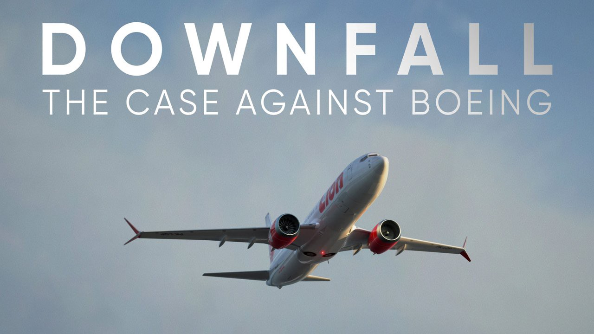

I just watched the documentary [DOWNFALL: The Case Against Boeing](https://www.imdb.com/title/tt11893274) and have feelings stirring inside me that I want to get down in writing.

_source: Netflix_

The documentary takes us through the timeline of the corruption of Boeing’s previously pristine and highly functional culture of engineering (and safety) excellence until the tragic loss of 189 lives on Lion Air flight 610 and 157 lives on Ethiopian Airlines flight 302, crashes that happened within months of each other.

When lives are lost, everyone pays attention. And of course we should — this short life is all we have!

This is the lesson I learned that the documentary revealed to me: **profit-above-all corporate culture is incompatible with a culture of engineering excellence and can lead to catastrophes**.

## why I care about this

As I heard the narrators explain the technical fault — that the “MCAS system” took over based on faulty input (because the system had a single point of failure, relying on just one point of attack sensor that could be misled by something as simple as a “happy birthday mylar balloon” knocking onto it mid-flight) — I frowned hard.

I’m a software engineer. I _could have_ been the one who wrote the software that processed the input from the point of attack sensor and did something with it. I wasn’t, but I could have.

I encourage you to watch the documentary to understand the other forces at play (greed, mainly) that caused the crashes. I want to focus on the software piece of this story.

The problem wasn’t that the software was faulty—**but it does sound to me like the software engineers wrote software that _expected_ valid inputs.**

So the cascade of information in the MCAS system purportedly goes like this:

1.  point of attack sensor continually sends nose angle data into the system software
2.  software processes data and if the nose angle is deemed too high, it sends a message to move the jackscrew motor at the tail of the airplane so that the horizontal stabilisers moves up (I think it’s up) and forces the plane to take a nose dive to correct for the high nose angle
3.  after 10 seconds, software enforces a cool-off for 5 seconds before restarting the process if the nose angle is still deemed to be too low

What could go wrong? I mean, really, if I sat down as a non-aviation software engineer and asked myself this question, what would I list down? This is what I can come up with:

-   **runaway software**: if the input is corrupt (e.g. based on a the malfunction of a single point of failure like the _single_ point of attack sensor), the code could be incorrectly causing the nose angle to dip, and potentially causing a full-on nose dive. Or, as they say: garbage in, garbage out
-   **bug in the code**: if there was an edge case in the code that had not been tested for, since it had control of the horizontal stabilisers, the code could cause catastrophic adjustments

The list isn’t long, probably because I’m still racking up my years of experience as a software engineer, but even I would think about the potential problem of corrupt inputs. And I would have certainly raised this as a problem. (The documentary reveals that engineers at Boeing who raised safety concerns were fired or had their salary cut. What the f\*\*k!)

## engineer, not developer

I currently work at [Shopify](https://medium.com/r/?url=https%3A%2F%2Fshopify.com%2F) as a software engineer and this documentary makes me take my work more seriously. A life may not be on the line, but several thousands of livelihoods might if _I_ fail to develop and test the code that I write before pushing it to production. That is still a huge responsibility.

I’m not sure how easy it would be for me (or other software engineers) to make a catastrophic mistake at work as I punch the keyboard in my home office and push my code to production, although it does feel like it could happen rather easily if I let my guard down and not strive for engineering excellence.

To end this off, I want to say this: I think **there’s good that comes from calling ourselves software _engineers_ and not software _developers_**.

I, at least, feel like I hold myself to a higher standard when I liken my work to that of mechanical, civil, and aircraft engineers, to name a few. Lives _are_ at stake!
