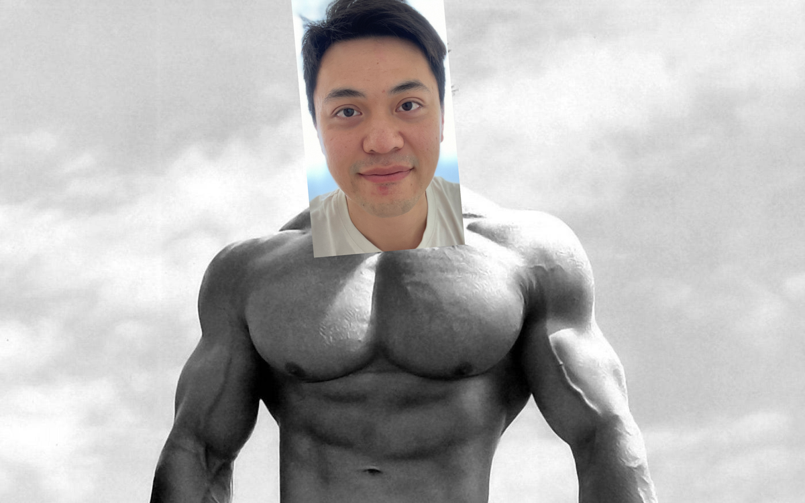
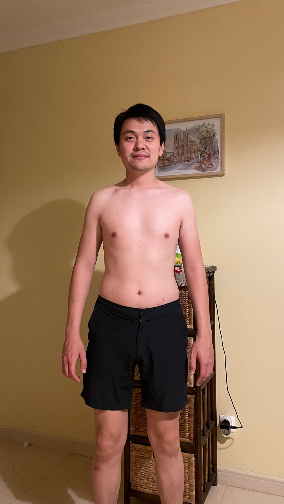

Hearing Arnold Schwarzenegger's story of rising from a little village in Austria to becoming the greatest bodybuilder of all time helps, but I can relate to his work ethic, not goals. I don't want to become a bulky hulky person.

But his work ethic - let's talk about that for a second.

He says that we sleep 6 hours, so that leaves us with 18 hours to do things like work, talk to people, and – oh wait, you caught that error? Nobody sleeps 6 hours. I like 8 hours of sleep! To that, he says "sleep faster." Reality distortion field alert...

But if the greatest bodybuilder of all time says something, you at least pay attention, especially when you're trying to get fit.

Right. So, what is my reason for getting fit?

I've only had one reason to get fit so far, and that came from being conscripted as a soldier in the Singapore Army. I really wanted to become an officer, so I did my first pull ups. At my peak, I did only 12. Once I ORD'ed (operationally ready-ed, i.e. finished my 2 year obligation to serve), I basically stopped exercising regularly.

I lost my reason to be fit. That forcing function had ceased to exist over a decade ago.

Soon after university, I got married. Another partial reason to stay fit – i.e. be attractive to find a partner, or not lose the one I have to another more attractive male – evaporated overnight.

Now I have a little belly. It's not too late for me, I know that, but I also know I am inching towards the point of no return. I feel it every time I yawn at the dining table for lunch. Dude, it's lunch time and you're tired already?

So, is that my reason? To feel less lethargic and generally more energetic throughout the day?

No. I know it could be a reason, but it would be a losing reason. Nobody in the history of successful stories became and stayed successful because they were trying to be "generally more X."

No, Arnold would smack me in the head. I know it. He'd say in his wonderful Austrian accent, You must find your purpose.

So what is my ~~reason~~ purpose for getting fit?

I'm in the southern coast of Portugal right now, on holiday with my wife and daughter. Over the last few days of being here, I've noticed my eyes involuntarily tracing the figures of people around me.

I look at women and men. Mostly I pay attention to those who are beyond their 20s, because, come on, you practically don't need to do anything to have a nice physique when you're in your 20s.

We are at the beach. My daughter is making indecipherable shapes in the sand. I sit in the sand about 10 meters from the waterline, with my wife by my side.

A couple walks by. A beautifully bodied couple. Probably in their early 30s. Possibly late 30s, given that a strong physique makes you look younger than you actually are.

I say to my wife, "Now that's a good looking couple. They're walking in their underwear to parade those hard-earned bodies. Good for them!"

My wife looks at me. She lets out a weak laugh.

I know what she's thinking. It's what I'm thinking.

Will we ever get back in shape?

I noticed throughout my trip here that the people I admire are not the ones who own 20-million-euro villas on the coastal cliffs.

I looked up to the people who look strong and healthy.

The people who I know I would automatically respect if we were having a conversation. Because I know that despite all of us having the same number of hours and similar struggles with work and life, they made it work.

So is my purpose for getting fit to feel more respectable? To be seen that way by another pair of tracing eyes sitting on that beach in Portugal a few years from now?

Again, no. That can't be a purpose. External motivations fizzle within days, we all know that firsthand.

But I tell that story for a reason.

That beach, that couple – they helped me confirm that I want to be strong and healthy. It's a desire that I have.

In fact, I've harboured thoughts of being intimidatingly strong for at least a decade now since I left the Army.

But the question remains. I want to be strong and healthy because **\_\_\_\_**.

What fills that blank?

For me, as far as I can tell, it is this:

I want to be strong and healthy because I want to be able to stand my ground around aggressors and protect my family – i.e. my wife and daughter.

Super macho, right? I know. I know how it sounds. But it's for a much more practical purpose.

I'm an Asian dude living in Germany. I look different from most people. Yes, I speak good, mostly accent-free English, but I don't sound like I'm from around here.

It's easy for me and my family (who look like me) to become targets of the mob when something happens that arouses xenophobia.

Like when COVID hit and we were in Germany and a handful of people with their masks on looked at me (also with my mask on) like I was patient-zero in Germany, just because I look Chinese and the virus originated in China.

Or more recently when I came upon a group of young men on the street adjacent to where I live. Visibly intoxicated, they walk towards me, bro-talking one another.

One of them stretches his arm out as he comes within talking distance to me and ruffles my hair. This rouses up his friends who laugh as they collectively walk by me, beer in hands.

Maybe they just wanted to know if Asian hair really was thicker than theirs. Or maybe they harboured hate towards Asians and wanted to antagonise me. Or perhaps it had nothing to do with race and they're just jocks.

Whatever their reason, I find it unacceptable. But I say nothing and let it go. Pick your fights, I say to myself internally.

Living in a place I'm not born in, where I look different, I imagine there will be a few fights before I'm an old man.

If that incident had happened differently – if that jock rubbed my daughter's head as disrespectfully as he did to me – well, that's going to be a fight I'll pick.

Except, I know I still probably won't.

Because I know I don't pack a punch.

What I would really like is to know that when fucked up behaviour appears at my foot, I can actually knock some teeth out before I go down.

In other words, I want to have the confidence that I can effectively defend myself and my family.

That's my purpose for getting fit.

But I share the same hope as the Singapore Armed Forces. That having a strong physique will deter aggressive behaviour around me in the first place.

I'm starting my lifelong journey of getting and staying strong and healthy today. I may post updates as I progress but here goes the "at the beginning" pic of my body:

_No punch man, for now. See you in 3 months._
