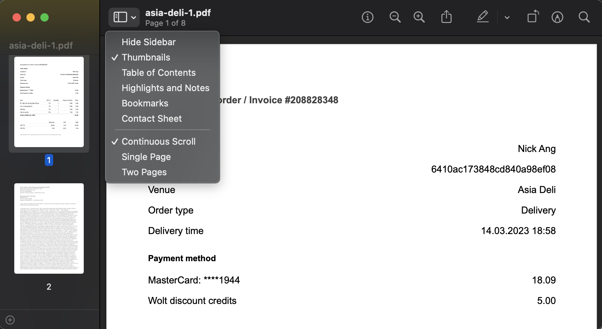
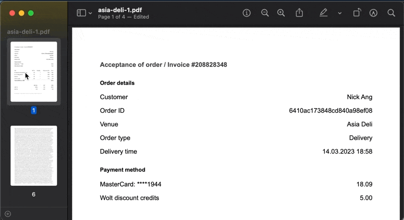
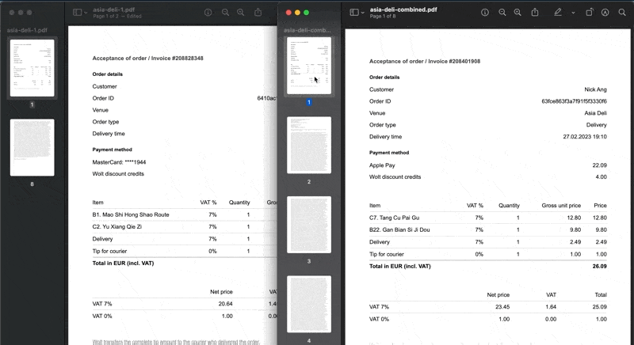
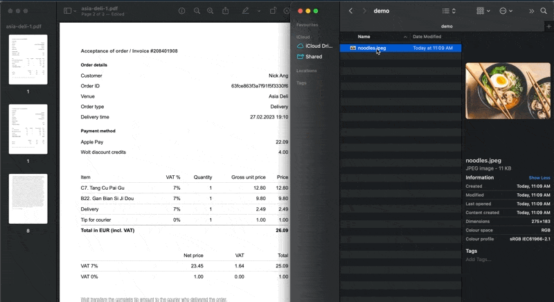

This post is simply to put a stake on the internet help people with macOS computers that the built-in Preview software is probably good enough to meet your needs. You don't need to use ominous online PDF tools or pay for Adobe Acrobat just to combine images and PDFs into a single PDF.

What kind of needs can be met?

- Combine 2 or more PDFs together
- Add 1 or more images to an existing PDF
- Deleting pages in a PDF

How?

As with a lot of Apple's software, the procedure is actually super intuitive... how do you imagine it can be done? That's exactly how it's done.

First, open the PDF you want to be the final, combined PDF.

Then, open the sidebar and set it to __Thumbnails__:

From here, you can do what you expect to be able to do.

For example, click on any thumbnail and hit the `delete` button to delete a page:

To add a page from another PDF, you open both PDFs in Preview, open both sidebars, and just drag-and-drop:

You're not limited to adding pages from PDFs. You can also add images by drag-and-drop:

Once you're done, save the file, and you're good to go!

This is how all software should operate. Intuitively!
