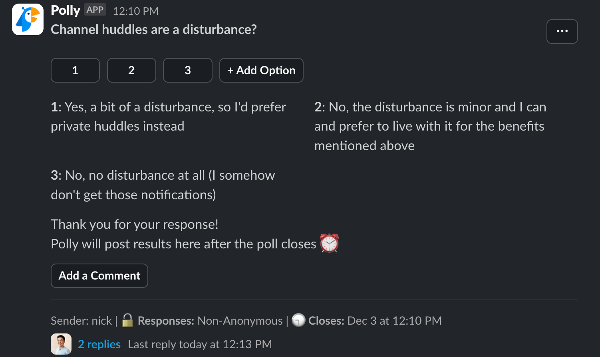
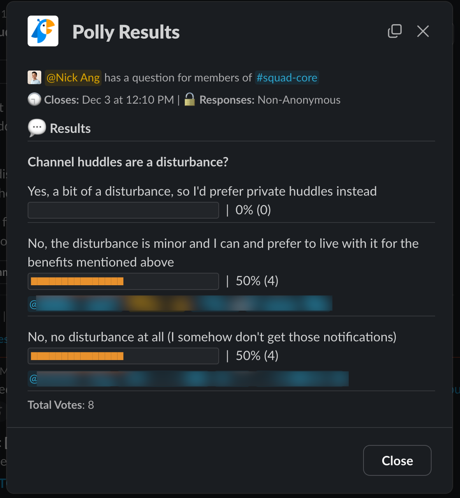

Regular day, I'm doing my work as a software engineer when I receive a DM from a colleague:

> Nick, got a moment? I want to run something by you. I want to understand translations from an engineer's perspective.

Sounds like a reasonable use of time, so I say, sure. But before starting a Slack huddle, I suggested this:

> Hmm, start a huddle in the team channel? In case someone else wants or could join to give or get context around this too.

He replies that he's hesitant to do a public huddle because he's concerned that it would disturb other team mates unnecessarily.

That's a fair concern. Notifications can grab people out of their flow, and returning to a similar state might take 15 minutes.

So we had our call in private. I show him how I handle translations in our apps as an engineer.

The whole time, however, I was bothered by the fact that this conversation was flying under the radar from the company. We were losing opportunities for serendipitous things to happen, like:

- Someone sharing that someone has made a recording explaining the system before
- An engineer/product/salesperson joining the call to gain a quick understanding of the system

So right after the call, I setup a poll in Slack for our team. I wanted to survey **this particular team's** attitude towards public vs private huddles.

The poll was setup and sent in Slack in 5 minutes and looks like this:

I explained the context in a message in the poll thread:

> Context: I noticed someone was reluctant to start a public huddle, worrying it will disturb folks. So I thought I would survey the team to understand how we feel about it

With that, I let the members of our team answer the one-question survey for the rest of the day.

By day end, I closed the poll and shared the results:

With fresh data in hand, I conclude with a new message in the channel:

> TL;DR: Please don't hesitate to create huddles in this channel!

I'll attach a screenshot of the message so you can see how it was received based on emoji responses:

This, I think, is the perfect way to quickly validate -- or in this case, invalidate -- assumptions that you or your team mates have about team best practices.

We don't have a Confluence team page or equivalent in this startup, but if we did, I'd document this there.
