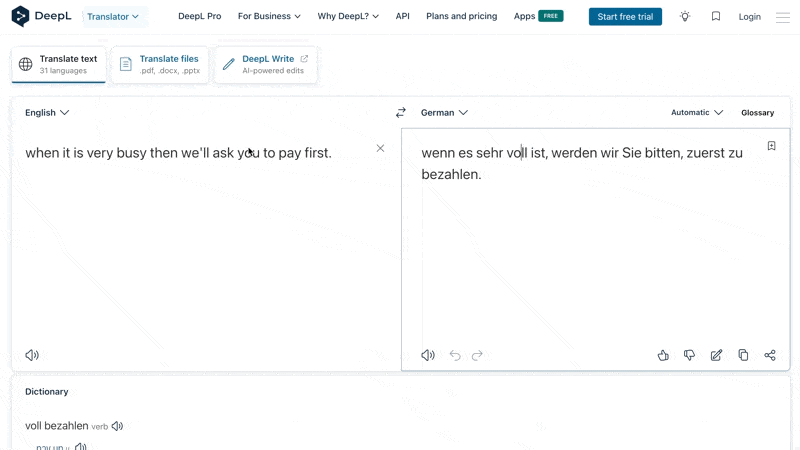

This is a short blog post to share a fantastic use case I've discovered for conversational AI based on large language models (LLMs): making intelligent guesses of what someone said in a spoken sentence.

Recently I was in a cafe in Düsseldorf, Germany. I took one of those corner seats where I can be alone to enjoy a quiet morning when the waiter came up to me with my order. Black coffee and a croissant. I thanked her and stood up, saying "Bezahlen?", which I meant as shorthand for "I'll come with you to the counter to pay now."

As is often the case, because I'm still learning German, I could infer what she was saying, but I wasn't sure exactly.

My inference is that she said, "No problem, you can pay later. When there's a lot going on, then we ask that customers pay first. But when it's not so busy, it's fine to pay later!"

I smiled and said, "Alles klar, vielen Dank!" (Which means I understood, thank you.)

As she walked back to behind the counter and I took my seat, I started to wonder about the sentence she spoke. I wanted to know how to say what she said. That's how one learns a language, right? By uttering one mimicked, scenario-appropriate sentence at a time?

All I heard was:

> "wenn ... **los** ist, dann ..."

Those ellipses stood the words I didn't quite understand. Those were my gaps.

The bolded word *los* is the word I was curious about. How can that word mean "busy"? I knew what it meant, and busy was not one of the meanings. Hmm...

But from the structure provided by the words that I did know -- the very common *wenn ... ist, dann ...*, which means "when ..., then ..." -- I could *infer* that she was trying to tell me that when it's busy, then we ask customers to pay first. Otherwise, it's fine to pay later.

Nice to have a brain that can infer! But this unfortunately does me no good in learning how to say the sentence myself.

What can I do?

I first tried to translate what I thought from English to German, hoping to find the word "los" being used in the translated output. Doing that on DeepL didn't yield a desirable result:

*Conventional translation: Fail*

DeepL is an amazing tool; it's just not suited for this kind of reverse engineering of a spoken sentence.

So I turned to ChatGPT because I have a paid subscription. I'm no prompt engineering guru, but I had an instinct that as a LLM trained on a gynormous corpus of words in various langauges, it would be able to make intelligent guesses and fill in the blanks for me.

Here is the first attempt, which was already a successful attempt:

*Contextual multi-language semantic search: Success*

In case that screenshot is not loading for you, here's my prompt in text:

> A waiter in a german cafe said something about "wenn ... los ist" and I'm taking it to mean "when it is busy, then we'll ask you to pay upfront, rather than later".
>
> I need help understanding what a proper german sentence would look like with the word "los" to mean "busy"

And here is ChatGPT 4's response (emphasis mine):

> In German, the phrase "wenn ... los ist" can be a bit tricky to interpret directly without the full context, since "los" has several meanings. However, based on your interpretation of the situation - that you'll be asked to pay upfront when it's busy - it seems like the waiter might be using "los" in a sense similar to "busy" or "a lot going on."
>
> A proper sentence in German to convey this meaning could be: "**Wenn viel los ist, bitten wir Sie, im Voraus zu bezahlen**." This translates to "When it's busy, we ask you to pay in advance."
>
> The phrase "viel los ist" literally translates to "a lot is going on," which is a **colloquial way** to refer to a place being busy or crowded. In German, "los" can be a versatile word, often used in informal contexts to describe a situation with a lot of activities or people.
