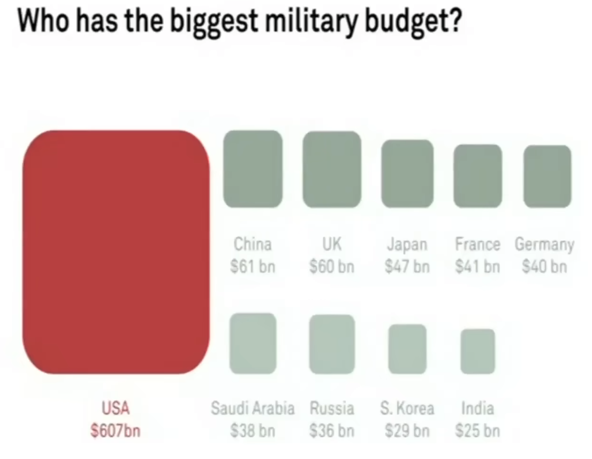
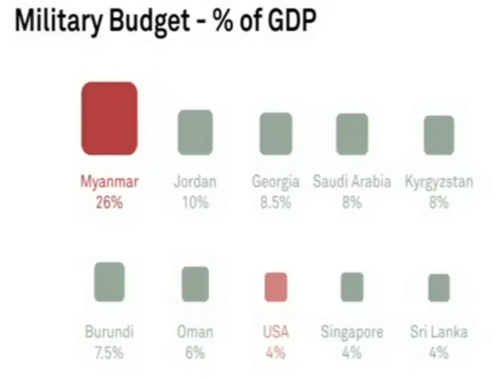

I'm currently doing the Google Data Analytics course on Coursera because of a recent itch to learn how to be more proficient in querying data to answer business questions at work.

I was going through the data visualisation segment of the course and decided to search YouTube for "data viz." That's when I stumbled upon this lovely [TED talk](https://www.youtube.com/watch?v=5Zg-C8AAIGg) by David McCandless.

## The beauty of data visualisation

He went from programmer -> journalist/writer -> data visualisation designer. Interesting career arc.

Also, this video was uploaded 11 years ago on YouTube by TED-Ed.

- Why is this interesting? Because of one thing he said (paraphrased): **society has an information problem** these days. There was one 11 years ago? Well I'll be damned because the problem is probably worse now.

Good data visualisation mitigates the problem of misapprehension and misinterpretation of the truth about a situation.

- McCandless puts this forward without caveat. But it's undoubtedly true as well thta data viz can be used to confuse and misrepresent.

"Let the dataset change your mindset," was him quoting "his master" **Hans Rosling**.

_US has largest military spending_

_But US is not close to biggest spender on military relative to its economy!_

- He was talking about the question of "who has the biggest military budget" and how it's US in absolute terms, but looking at it in absolute terms give us an honest picture because US has a GDP that is more than the next few wealthiest countries combined.
- We ought to look at the data in **relative terms** instead. That makes China the largest military spender relative to their economy. Singapore pops into view as it spends 4% of GDP on the military, the same as the US!
