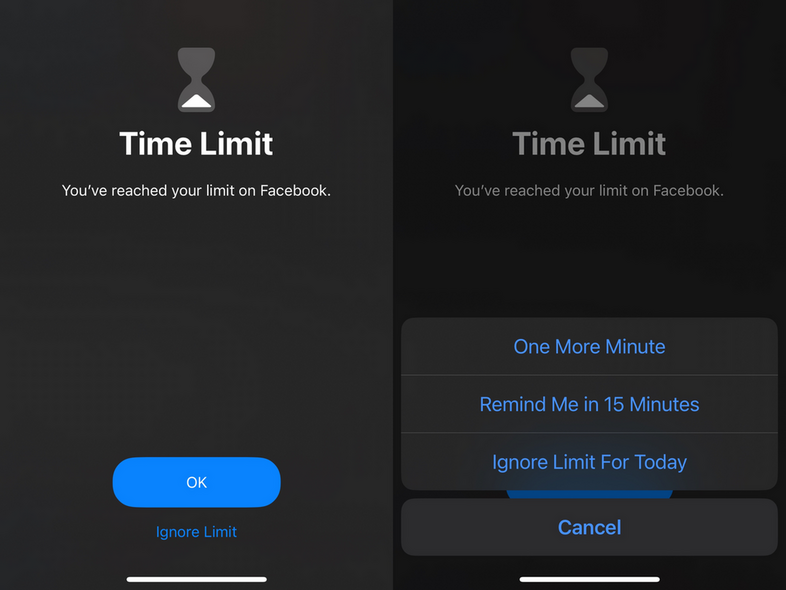
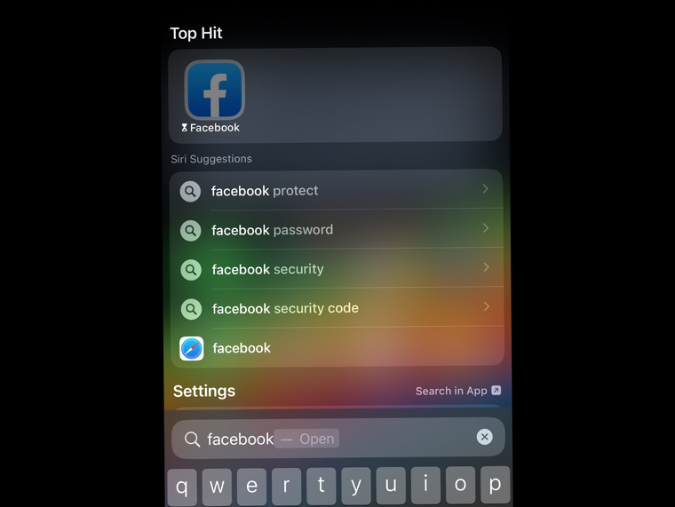
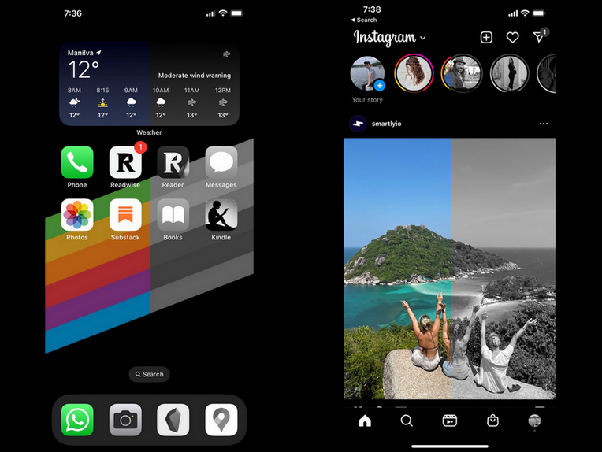

I often get overstimulated when using my iPhone. For me, it's a subtle build-up of smaller moments of stimulation that leads to overstimulation by the afternoon. It goes something like this:

- (Random moment of the day)
- Picks up phone and habitually launches Gmail even though not awaiting someone's email
- No email? Launches Instagram to see what's everyone up to
- Subconsciously compares my life with another's and my mind thinks either I'm superior or inferior
- Mind wonders, has anyone recently started a new company or job? Opens LinkedIn
- Subconsciously compares my life with another's and my mind thinks either I'm superior or inferior
- Someone's post catches my attention; goes down an online stalking rabbit hole
- Mind gets exhausted from processing information
- Heart gets weary being not as good as others at job/storytelling/business/socialising/etc.

This is just one of the paths I could head down every time I pick up my phone. Sometimes I pick up, check Gmail, and lock the screen. Other times I do the whole spiel, and I just feel tired by the end of it. I can literally feel my brain getting saturated, and for no real purpose.

I've found a couple of things helpful in coping with this unnecessary source of anxiety and low-key pain. Read on to learn these tactics. They work every time.

## Automatic time-based restrictions

First, I use my iPhone's Screen Time built-in restrictions to limit my app usage by duration. Have to admit, it felt juvenile to have to set this up initially, like, _can't I trust myself? Geez._

But I have since forgotten that I'd set it up in the first place and it's just automatically setting up invisible time barriers every day for me with my phone. It's life changing.

When I hit the time limit, the screen gets overlaid with a message by the OS that forces me to pause and ask myself: to continue, or stop here?

Every time I don't hit OK and instead select "Ignore Limit" followed by one of the time extension options, I feel like a man-child who is deciding to have just a few more potato chips. Just a little my ass.

So, over time, I've learned to not habitually dismiss these time limit prompts because I know, just like eating too many chips, there are consequences, like said mental and emotional fatigue.

This helps, but there's another part to the solution. I also use the Screen Time > Downtime feature to tell my phone that from 10pm to 8am, disable all but a few apps. Apps that are not explicitly in the allow-list will appear disabled:

And if I tap the app icon, it'll bring up the prompt in the screenshot I shared earlier.

These two things have been incredibly helpful to me because they work automatically in the background.

But even with these set up, I still occasionally go down the rabbit hole. I still occasionally eat too many chips. I'm a man-child and I do not have respectable self-control.

Setting up these limits is like buying fewer bags of chips - I have access to fewer unhealthy snacks at any time in the apartment, but with whatever I do have, I can still overindulge (hitting the Ignore Limit button and selecting Ignore Limit For Today).

So, occasionally, I've had to intervene more tactically. Thankfully I've found that there's another built-in feature that can help - greyscale mode!

## Tactical greyscale

I don't know if this was a touch of genius by someone at Apple to help reduce overstimulation or if it's intended more prosaically as an accessibility tool, but I've used the greyscale colour filter to great effect in instantly reducing the stimulation I get from looking at my phone.

So, the way it works is that I've set up my iPhone's power button so that when I triple-click it, the screen turns greyscale (= various tones of black and white). The result is stunning in the way that I want. Here's an example I stitched together showing the differences in my home screen and Instagram feed:

It makes a HUGE difference. Black and white instantly removes 92.4242% of the stimulation!

But yeah, those are it. Together, these three simple, free things have helped me tame the problem of overstimulation: two strategic (always on app limits) and one tactical (colour filters).

If you do occasionally feel mentally drained from using your phone, I highly recommend trying to set up the greyscale colour filter shortcut! Maybe you could even leave that setting turned on permanently if you're really sick of the stimulation.

Here are some links to articles explaining how to set up Screen Time and greyscale on triple click on your iPhone:

- Using colour filters (greyscale is one of them): https://support.apple.com/en-us/HT207025
- Using Screen Time limits: https://support.apple.com/en-us/HT208982
