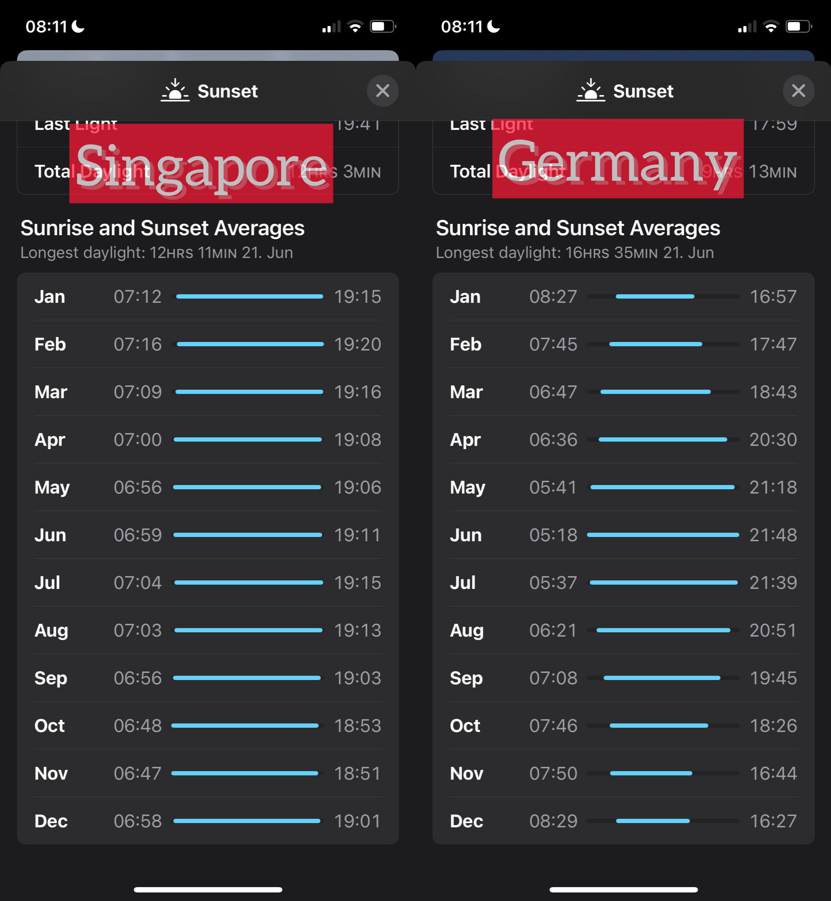

At the beginning of 2025, after a year-long confusion about why I've been feeling increasingly anxious, I decided to give up coffee. By the end of January, a month after giving up the substance, my anxiety has fallen significantly. I feel about as confident as I was as a university student again (that is, very confident).

It might not be immediately obvious, but my encounter with anxiety and eventual success in reducing it with a single intervention has everything to do with paying attention.

I didn't need to pay attention to the fact that my heart would beat out of control when I'm due to make a presentation in front of people. That part is visceral and steals your attention.

But if I hadn't paid attention to the little details of my life -- that I had been drinking two cups of coffee a day while working from home, that my resting heart rate seems much steadier on weekends when I don't drink coffee -- then I would probably not have drawn the link between cause and effect.

Paying attention, therefore, brings tangible benefits to our lives. But I'd argue that noticing things by paying attention isn't just a utility.

One January morning, I noticed how bright it was when I opened the blinds. I wake up at roughly the same time every morning, so it was easy to feel the difference.

I then thought I should check my feeling with facts. There are, after all, meteorologists who record sunrise times. Sure enough, I see that we are, at the end of January, on the upward climb in terms of total daily sunlight.

I then noticed a geiser of interesting thoughts. Like how greatly different this is from my former life in Singapore, where the variation in sunrise and sunset times is negligible. See this side-by-side comparison (taken from the iPhone Weather app):

Now, the difference is visible in those lines. There is built-in variation in life in Germany compared to Singapore, at least when it comes to weather. And now I can hold this screenshot in my mind and, as I continue paying attention to things happening around me and inside of me, I can begin to attribute more behavioural phenomena to it.

The effects snowball. Decaffeinated me can hold this in my mind longer than caffeinated me, contrary to what I previously thought (stillness is by definition less disturbed). The better we are noticing things, the better we are. The better we are, the better we are at noticing things.
