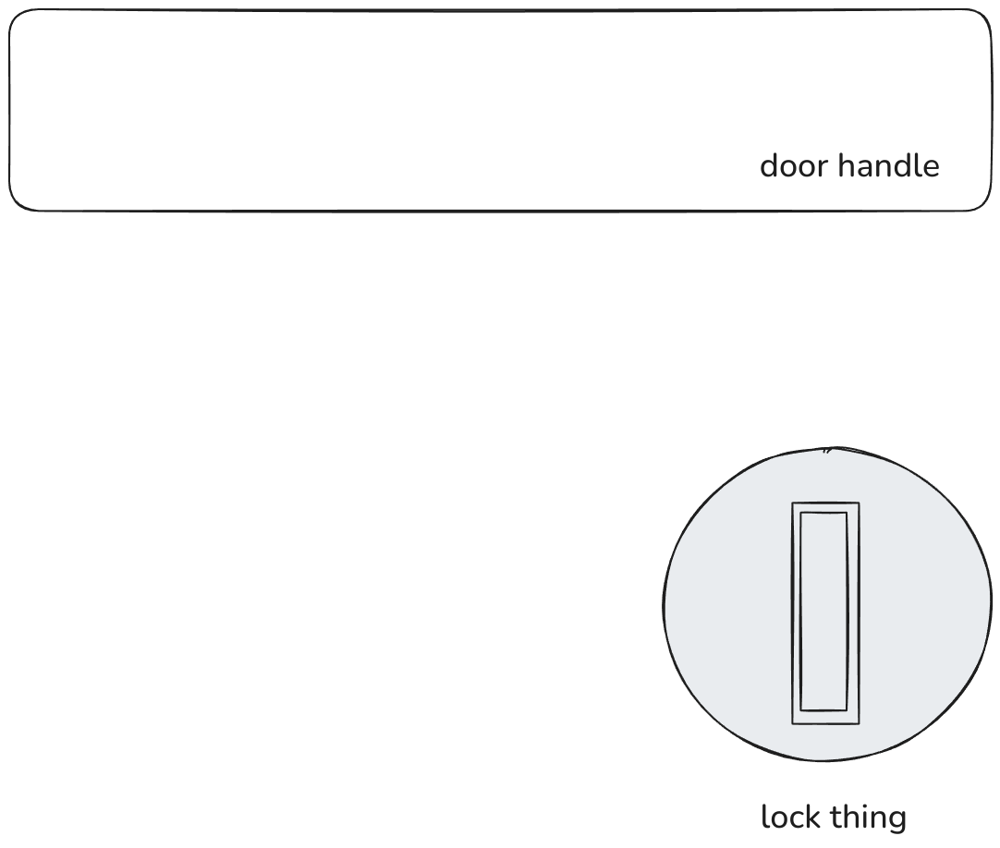
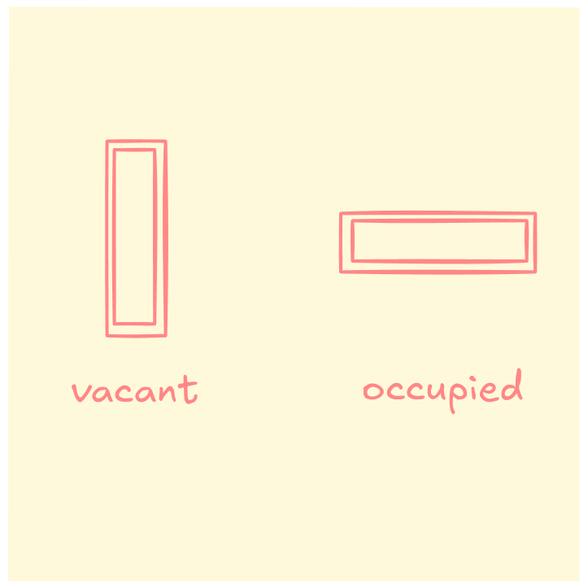

It was my first week at a startup. I was in the office meeting people and setting up my laptop, doing all that typical week 1 stuff.

At some point I had to use the toilet in the office, but as I approached it, I noticed it lacked a sign of whether it was occupied. It only had a metal round thing that looked like this:

What was this telling me about the state of the door? Was it locked or not?

I quickly draw the conclusion that there was no way to know. The middle rectangular part is depressed. It looked like the kind of thing you would jam a coin to unlock the door from the outside in an emergency.

The people who designed this lock could have made the arbitrary decision to make "vertical" mean locked and "horizontal" mean unlocked. Or they could have made the arbitrary decision of the opposite.

There's no way to know if it's locked based on this, or any other signs on the door.

So I did what I think any logical person would do in this situation. I waited for 3 minutes. Okay, 5 minutes, because it's my first week.

Then, seeing that nobody came out of the toilet, I opened the door, found it vacant, and proceeded to do my business.

When I was done, I decided to do something about this poorly designed door lock. I didn't want anybody to have to go through what I just went through, because:

1. It's a waste of people's time to wait.
2. It saves people potential embarrassment.

So I find a post-it pad and a red marker ('cos I couldn't find any other colour) somewhere and drew this:

And I pasted it on top of the door knob, satisfied that I've just done a good deed.

---

An hour later, me and a few of my colleagues were going to lunch. One of them saw the post-it on the way out and casually said to the other something that I will never forget:

> Pfft. Anyone with half a brain knows how a toilet lock works!

Then he bro-chuckled at the other person, whom I could tell was giving him a lukewarm smile.

I remember thinking, wow, this guy's an asshole on two levels:

1. You clearly didn't consider the very real possibility that the new guy (me) wrote this (lack of EQ)
2. You also clearly don't understand how things are designed (lack of real-world understanding)

That was the moment I knew I wouldn't last long in this startup, because clearly they hire assholes and I don't work well with them.
