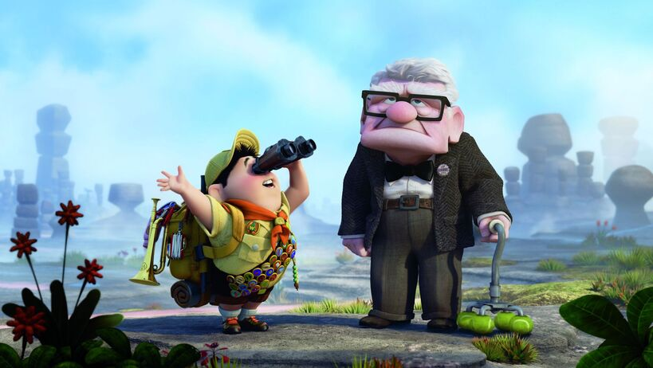

My wife tells me about a person she knows. We affectionately call him the "Up uncle" because he looks like the uncle from the animated film, Up.

Anyway, this man likes to spend money. He'd regularly spend money on expensive watches, and his wife is the same, buying up luxury bags and sharing it incredibly casually on their Instagram accounts.

One time, they visited Dubai and the first thing they did when they landed was to go to a shopping mall. He got a Cartier watch and she got a Gucci bag. Being Singaporean, I know that these two items add up to something in the regions of SGD 20,000 to 30,000 (divide by 1.5 to get Euros).

In an Instagram story, he uploaded a video of a conversation of him and his wife.

"Wow, the bubble tea is $8.50 here!!" she complains.

"It's okay, I've got money!" he replies. It's as if spending money frivolously is supposed to be a triumph.

Every one of their Instagram posts are about purchasing things.

As my wife finishes telling me about these people's lives and the way they choose to live, I shake my head.

Show me a person who is proud of how they're wealthy enough to splurge frivolously and all I see is a person lacking inner peace. And with each purchase they go further and further off-course. From the outside it's like watching a person work themselves to their early death for a few totems of envy.

Yet, at the same time, I have to admit that there is a high probability I would have turned out the same way had I remained in Singapore instead of leaving for another country like Germany.

Close to hundred percent of the population in Singapore plays the status game. It's the product of growing up in a country that went from nothing to the world's most respected economic miracle and millionaire's playground in less than 60 years.

You see rich people everywhere, and because the entire island is urbanised, the only way to spend one's money is buying houses, cars, and luxury goods.

Germany is over 400 times larger than Singapore and it has mountains and more than 12,000 lakes spread across the country. People here who don't have a lot of money will nevertheless have plenty to do outdoors with a bicycle, a pair of hiking shoes, or some shorts and sunscreen.

What makes the culture here more nature-oriented and less materialistic is the significantly lower chance of encountering a version of the Up uncle on a given day. Fewer people to flaunt wealth to in a given space means fewer reasons to do so, and even with time, that culture doesn't develop.

Don't be proud of the wrong things.
