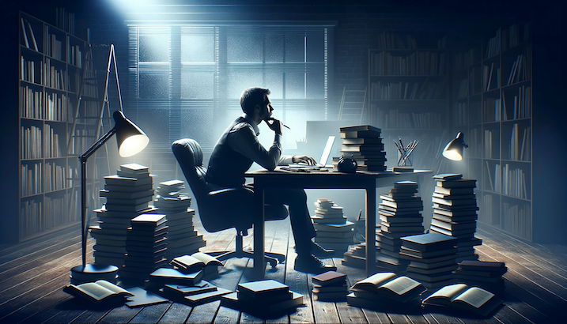

As a writerly person, should you spend your down time reading or writing by default?

I tried to answer this tough question in a [post](https://nickang.substack.com/p/13-to-read-or-to-write), where I declared:

> For me, reading is like filling my bottle with seawater when I’m thirsty - I’m not going to be able to drink it until I distil it. Writing is the process of distilling potable knowledge.

This I still fully agree with (luckily, because that post was published only a month ago). But at the same time there are good reasons to default to reading instead.

Like when you're unsure about something that you feel is important to get a grip on. For me, for example, that something could be "wondering about how to evolve into a person who is helpful to people outside of work using my expertise in writing and software engineering." Would it be possible toto write my way to clarity here?

I've tried many times, so I'm inclined to say, flat out, no. It turns out that the prequel to the "drink seawater" metaphor is knowing where to find water. Any kind of water.

Reading, especially reading broadly, will undoubtedly expand your mind. And where do ideas invariably come from?
