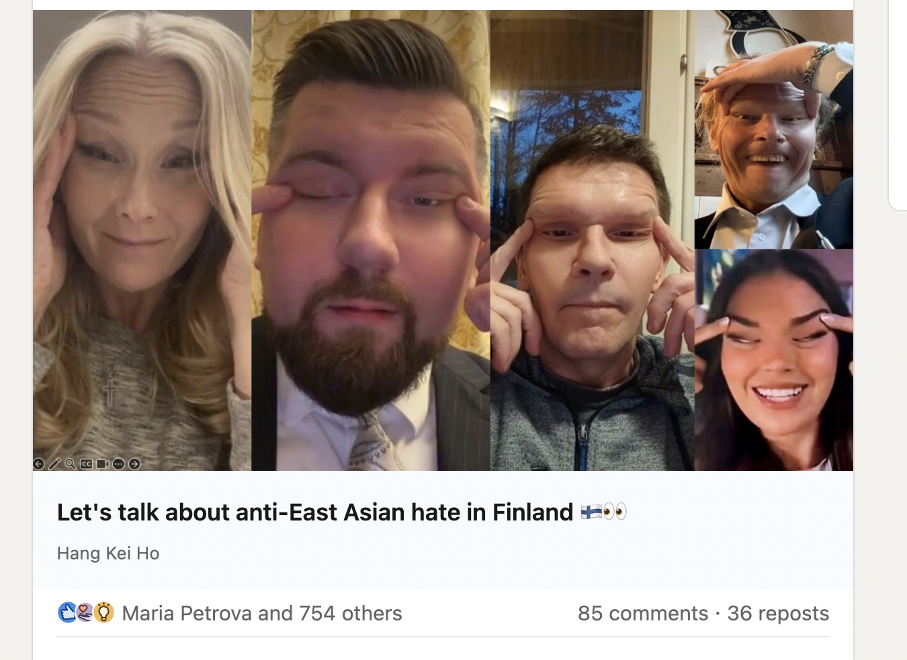

We can't choose the parents we were born to, nor can we choose which country we were born in.

So when some people act like they are superior to others based on race, ethnicity, or nationality, it's as transparent to me as someone saying "hey, look, I'm cool for being X, which coincidentally was mine already at birth!"

I once was at a German friend's 30th birthday party. The host, the birthday boy, is asking for volunteers to a round of "who can hold the beer mug for the longest" – a fun, harmless little game.

I volunteer because it sounds fun.

I get my full pint of beer. I hold it out in front of me like the other contestants. The timer starts. My arm is parallel to the ground.

It couldn't have been more than a minute, but I find myself slowly lowering my arm... this thing is heavy!

To my right, a German guy in the party, shouts out loud –

"C'mon Nick! Do you want the German passport or not!?"

First thought: wow, this guy's a dick.

Second thought: how come nobody found this inappropriate?

Then I hear someone speaking up. She says, "dude, he's Singaporean. The Singapore passport is better than the German passport!" The German guy looks genuinely confused at this point.

I'm staying quiet, because despite her small heroic gesture of speaking up, she, too, is missing the point.

This guy is born in Germany. Okay, so what?

I'm a guy born in Singapore. Okay, so what?

Did either of us have anything to do with those outcomes? Did we earn our status as members of respectable countries?

Could anyone, really?

Nope.

Even a lottery winner had to buy his own lottery ticket. A baby being born into a fortunate situation has nothing to do with the baby.

Stop being an entitled baby. You are not better than someone else just because you're white or have a better passport. You're just a luckier son of a bitch.

Act accordingly.

---

I was compelled to write this after hearing about the pageant winner and the politicians in Finland who posted pictures of themselves doing the small eyes gesture. Look how charming these people are.


Screenshot source: https://www.linkedin.com/posts/drhangkeiho_living-in-finland-has-profoundly-shaped-my-activity-7407408716188348417-1hyT
