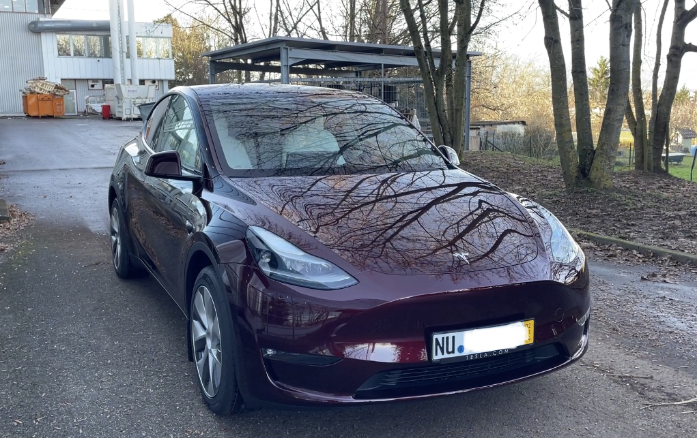
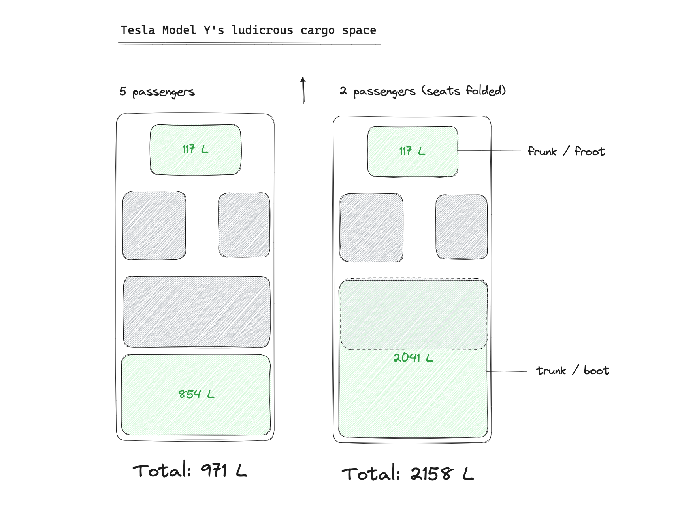

_Our Tesla Model Y Long Range in Midnight Cherry Red. I took this photo just outside of the delivery center near Stuttgart, Germany._

It's been 2 weeks since coming home with our Tesla Model Y and let me say, it's a really fun and functional car.

I'll talk through some noteworthy things in this post. First, let's talk about the not-so-nice parts.

<!-- ## Not so nice -->

## White seats

Because I got the white seats, I've had to spend 3 hours brushing it with a leather cleaner and microfiber cloth, wait a few days, and coating it afterwards with some expensive wax.

The result is great! But had I decided to go with the conventional black seats, I'd have almost no maintenance to do, or so I'd like to think!

The verdict on this good intention -- _white seats give a spaceship, futuristic, airy feel!_ -- is not out yet. I'll update you on the verdict on [the other blog post](/white-tesla-interiors/).

## Charging infrastructure fiddliness

Next - charging the car. You'd think this should be as easy as plugging in a cable to your smartphone, right? Me too, but boy are we wrong.

It's not as difficult as docking with the space station, but public charging stations take a bit of coaxing to work. Well, okay, I've also had issues with operating Tesla Superchargers.

On my first visit to a Supercharger, I had to ask a neighbouring Tesla owner how to release the charging cable because it was still firmly stuck in the station after minutes of struggling to release it. The guy was Dutch (I was driving near the Netherlands border) and was very nice, despite me asking a very basic question. He also showed me how to open the charge port by pressing physically on it without needing to use the app.

To take the cable out of a Supercharger, you have to grab the handle, pivot, and lift it slightly to release it from a catch. There weren't instructions for this at the station, which makes me suspect that this might not be by design. That just makes me worry even more! At least for now, the fiddlyness is behind in experience to using conventional gas pumps, which from my experience, are close to true plug-and-play.

But wait, there's more charging woes. It's not just stations that are hard to operate. My Tesla, perhaps because it was a showroom car that could have been slightly abused, the charge port often has trouble latching onto the charging cable that came with the vehicle. I've had to stand in the winter weather trying to tilt it this way and that, trying and get it to latch properly, pulling it out and pushing it in again and again, all the time holding on to my iPhone to unlock the charge port via the Tesla app.

Some of these could just be IBM errors -- idiot behind machine -- but if they prove not to be over time, I'll be calling in a service visit.

EDIT: I've done some debugging as a consumer by plugging in a different cable, and that one latches on the first try every single time, which means the problem is with the Type 2 cable that I received from Tesla. I've emailed them to ask for a replacement.

<!-- ## Nice things -->

Now on to the nice parts of owning a Tesla.

## Free city parking

Because it's electric, I could park without paying while charging the car for up to 4 hours in many parking spots around my neighbourhood in the city centre of Düsseldorf. Each hour of parking is 4 euros around these parts, so that's 16 euros saved with each charging session.

I've now rented an underground parking space so I'll not reap these benefits anymore, at least not in my neighbourhood. At other places, while electric vehicles are still on the rise, I expect this deal will still be relatively easy to find.

## Electrifying mentality

Next is the experience of owning an electric car in terms of having to charge it instead of pouring liquid fuel into it. It's been relatively easy to adopt the "plan for trips" mentality needed for electric cars.

Granted, I'm driving a Tesla Model Y Long Range, which has an advertised range of slightly over 500km on a full charge, but two things make this unrealistic: 1. it's measured in ideal, not real-world driving conditions; 2. Tesla themselves strongly discourages charging Lithium-ion batteries to 100%. Instead, I'm encouraged to charge only up to 80% for daily trips.

```
Range, corrected for real-world conditions = 500 * 0.9  = 450km
Range, adjusted for recommended 80% state of charge     = 360km
```

But even so, 360km of range for day-to-day driving is not hard to work with for most days. I haven't tried, but I think it's even possible to drive with 80% SoC (state of charge) to neighbouring cities that are 50-100km away from Düsseldorf, like Maastricht or Roermond in the Netherlands, and come back safely with enough charge left. (The other thing recommended by Lithium-ion battery experts is to keep the SoC above 10%.)

For longer trips, I intend to top it off to 90% or 100% the night before. Then I'm getting 450km of range to start the trip with, enough to get me to one of the Tesla Superchargers planted around Germany/Europe, where I'd need to take a lunch break anyway.

## Driving pleasure

Now there's the actual driving and handling of a Tesla. This part is easy to give two thumbs up because of how smooth and quickly it accelerates. As I've said before of other EVs, a Tesla glides on ice. And when it comes to cornering, the car stays close to the ground and the side flaps of the seats in the cockpit will snugly cradle you as you lean in.

I've been using the acceleration in "Chill mode" the whole time, and it's been powerful enough for me. I've been avoiding the "Standard mode" for a while because of the speeding tickets I got while test driving. It's too much power for me to handle! I'm a responsible driver; you're welcome.

## Frunk / Froot

The amount of space in a Tesla is kind of ridiculous. We're talking about industry-leading by 2,158 litres of space if you only have 2 passengers.



We have a kid, which means we have to keep a child seat installed in one of the seats in the rear. But in 2 weeks, even with groceries and trips to Ikea, I haven't come close to using all that space. As with many things, having the option is the ultimate win here. It's also nice that space weighs nothing. That's important to compensate for the immense weight of the battery pack.

Re: Frunk, or as I like to call it because of my UK English background, froot -- I'm surprised by how much I use it. At this point, I use it more than I use the boot because it's where I stow away the charging cable and my backpack/rock climbing gear. It fits both of these things very easily. The advantage of the froot is it doesn't require much space to open, and as a sane human being who parks with the butt in, I will always be able to access it when parked.

## Sentry mode

Sentry mode is a toggle on every Tesla. Because Teslas are now vision-based (as opposed to ultrasonic sensor- _and_ vision-based), and they have properly fine-tuned AI running in each of them, they are able to record malicious intent.

I've kept Sentry mode on since I picked up the car, and let me tell you, this thing is not a gimmick. It does deter burglars, because the screen in the middle of the car shows something that resembles an eye of Sauron whenever someone comes too close to the car. And when I enter the car again, it tells me, "3 events recorded," and I'll review the footage to see what has happened.

There's a big downside to this, though, and that's the battery drain. Sentry mode uses a lot of energy - more than I expect. I'm puzzled by how inefficient it is. Sure, it uses video feeds and has to constantly analyse those videos to decide whether an event has occurred or not, but can't it poll less frequently? I'm talking 3-8 percent drops in battery per day with Sentry mode on!

Because of this drain, I've turned off Sentry mode ever since I've paid for a private parking lot in a garage. To me, this is a good feature when you need it, like when you're in a sketchy neighbourhood or a city you know nothing about.

## Woopah

Because Teslas keep getting better with over-the-air updates baked into every car, our Tesla learned to fart this year.

It's called the "LockChime." Farts of varying length are included as a preset, so every time you lock your Tesla, one gets released. They sound so realistic that whenever my wife farts at home, I think immediately that my car just locked.

So as to not mix up my wife and my car, I've now changed the lock chime to a custom one. Of course it's customisable... One just needs to save a `LockChime.wav` file that is less than 1 MB in size in a USB stick, plug that into the car, and voila, the car is ready to play it every time you walk away from your car (when it automatically locks).

Since my wife and I love Chandler Bing, the character in Friends who is sarcastic and wonderfully comedic played by the late Matthew Perry, we decided that our first custom lock chime would be him saying "Wooooo-pahhh!"


Yet another delightful feature that is right up my alley.

## In case you're thinking of getting a Tesla

Use my [referral link](https://www.tesla.com/referral/nicholas360571) to get some promotions. At the time of writing this, the promotion was 3 months of free full self-driving (FSD) capability, which is super useful in North America but not in Europe. In any case, it's worth clicking through just to see if the promotion provides useful freebies to you. I'll also get some free supercharging kilometres.
