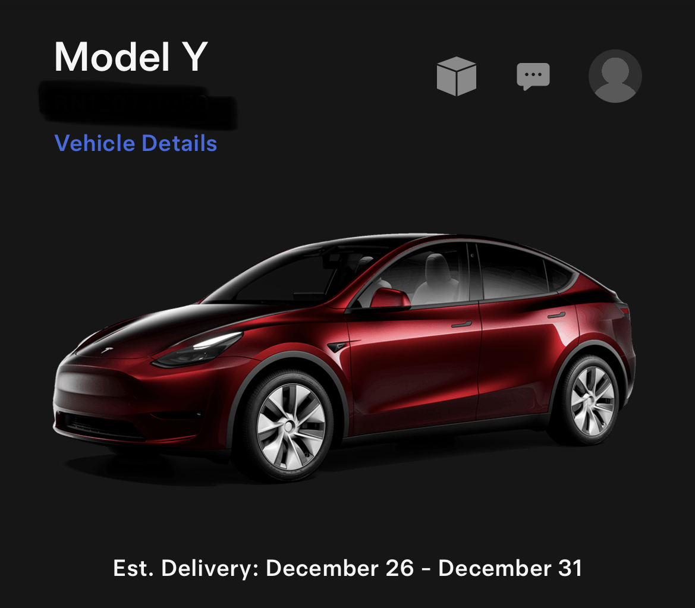
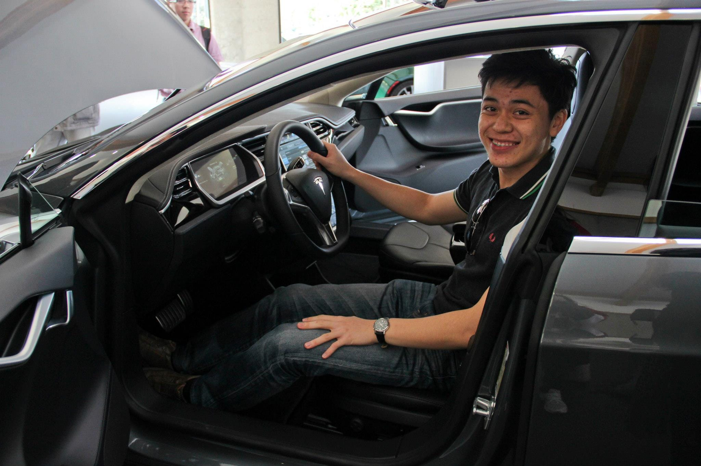

_Our soon to be delivered Tesla Model Y, seen in the Tesla app_

So, why a Tesla?

## 1. A dream since visiting that showroom in San Jose, California

Exactly 10 years ago in December 2013, I was in a Tesla showroom in San Jose, California, where I sat in a demo Tesla Roadster.

_Me in a Tesla Roaster in the San Jose showroom circa 2013._

I think that day -- this photo -- planted a seed in my head. I knew if Tesla were still around by the time I'd graduated from university and earned some money of my own, I'd buy one eventually.

I don't know what it was about the car or the showroom or the presentation by the woman from Tesla that stole my breath.

It could have been the madness of seeing a vision being turned into reality by an entrepreneur through sheer will and hardwork; or it could have simply been the futuristic aesthetic and engineering marvel of the Roadster. I'm guessing it's both, and everything in between.

And this year, after owning a campervan for over a year and having just moved to a new city that my wife, kid, and I all love, I couldn't stop thinking about finally buying one. I thought about it for the better part of half of 2023 before finally clicking Buy.

## 2. Tesla makes the most inspiring cars

I fell in love with electric cars the moment I drove one. The first ever electric car I drove was a Volkswagen ID 3, and I described the experience as "gliding on ice." It literally feels like an electric scooter that happens to weigh 2,000 kg.

And so I thought... if an electric VW drives _this_ well, how does an electric car produced by the pioneering electric-only automaker drive?

Thankfully, living in Germany, Teslas can be rented conveniently with a few taps on ride-sharing apps (although the fleet size is small, so a little hunting was necessary).

I first rented a Model 3 sedan, and just went "woooooww" the whole time, though I knew I wouldn't buy it because of how low and sporty the car was. If I were in my 20s without a kid, I'd probably have gone for it then.

Then I learned about the Model Y, which is Tesla's SUV. I hunted one down and rented it on the app and drove from Düsseldorf to Cologne (50km) and back with it at night. I haven't told my wife this, but I got 2 speeding tickets that night. The acceleration was a little hard to handle for a Tesla newbie, even if I am a cautious and confident driver.

The verdict that night? Because of the 2 speeding tickets, I swore out loud in the car (I was alone) that "fuck this, I'm not buying this, it's too fucking fast and hard to control!"

I also felt that the suspension was a little too stiff for my liking, It felt like I would get backaches from doing trips longer than 100km. And I doubt it would be comfortable for my wife and kid either.

Over the coming months, I considered many other cars. I looked at every car parked in the neighbourhood whenever I walked the dog. None of them felt inspiring. None! Okay, maybe some of the definitely-out-of-my-reach cars, like the Bentley Continental GT did inspire, but none of the cars that I could afford did.

So I went back to researching about the Tesla Model Y.

Stiff suspension? Apparently that got fixed in 2023, so all newly manufactured Model Y's came with "comfort suspension."

Overly powerful electric motor? I'll learn to tame it. And I won't buy the Performance model, just to be sure.

So now the main sticking points were kind of resolved. (When we want something badly, it seems our minds are perfectly happy to bend reality to fit our beliefs.)

All that was left were the good stuff. And every YouTube video I watched about the car just piled one good stuff one top of another:

- Active safety
- Dog mode, camping mode, sentry mode
- Reassuringly low center of gravity
- Futuristic and minimalistic white interiors
- Ridiculously spacious boot and froot and interior
- Best-in-the-world AI copilot (it's not really an autopilot)
- Best-in-the-world trip planner integrating with the biggest-in-the-world supercharger network...

I mean, that list does go on. See what I mean by inspiring?

But wait, there's more... the car gets better over time because of over-the-air software upgrades. And we're not just talking about frivolous holiday gimmicks that turn the car into a light show. I'm talking about software updates that [make old hardware work like new hardware](https://www.reddit.com/r/TeslaModelY/comments/16k9ai9/new_software_update_2023324_hardware_3_wow/).

## 3. An homage to the company

From my point of view, they're the automaker that single-handedly brought electric cars into the mainstream consciousness. Elon Musk had an audacious plan to produce luxury electric cars (the Tesla Roadster) for sale to fund the future (now!) production of the everyday electric car (soon to be released Model 2, with an estimated price tag of only 25,000 euros).

This being my first electric car, I thought I'd give more than a hat tip to Elon Musk and his revolutionary company. They may pay the occasional lip service about "furthering the transition to a sustainable future" when offering to extend the German Federal electric vehicle subsidy out of pocket, but given the extent to which they've actually done that already by making electric cars sexy and mainstream, I think they've earned the right

Also, the time pressure might have added to my final decision to buy. I still don't know if I'll manage to take delivery by 31 December, considering the amount of bureaucracy I'll need to navigate till then, but it's worth a shot.

*The discount message on the Tesla Germany demo vehicles inventory page.*
