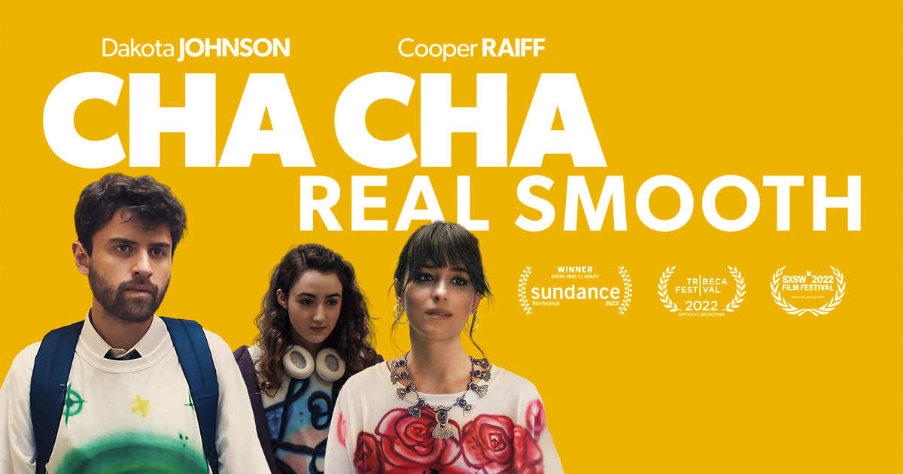

Yesterday my wife and I watched _Cha Cha Real Smooth_ on Apple TV, a movie that shows why growing up is hard.

The theme of the movie hit all the right chords for us as parents, former fresh graduates, teens, and kids. I'll remember the colourful and melancholic scenes from this movie for a long time.

After the movie I talked a bit with my wife. I mentioned that we should want for ourselves what we want for kids.

If we want our kids to have a joyful life, we should want to have a joyful lives ourselves.

If a big part of the equation of leading a joyful life is doing work that one loves -- so that work life doesn't suck but instead provides money and meaning -- then we should try and gear up our children to love what they do.

But how?

How, especially if we don't know how to crack that problem ourselves?

So there are 2 parts to this call out:

1. We always want what's best for our kids, but we don't always want the best for ourselves. That double-standard doesn't always make sense, because they're not always mutually-exclusive.
2. For us to gear up our kids to live a joyful life, we need to live a joyful life ourselves first, so we can show them at least one path that leads to it.

As _Cha Cha Real Smooth_ achieved with its motion picture, the best way to teach is to show, not tell.
