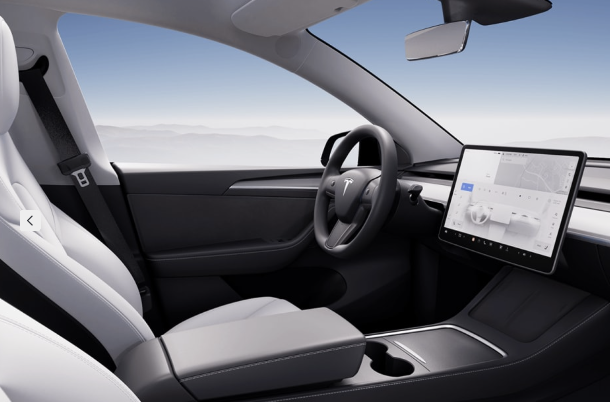

We just [bought a Tesla](/tesla). Even though it hasn't arrived, I'm thinking a lot about one aspect of its configuration: the white interior.

*Source: Tesla's configurator*

We're a family of 3 and a dog, and I choose the white vinyl seats instead of the black ones. Am I crazy?

I don't know yet. It's a gambit. It's a good intention: I want the riding experience in our new everyday vehicle to be... hmm, what's the word... to be elevated.

Most car interiors are black. It's a practical choice! Food and dirt stains aren't obvious, and can be dealt with later rather than immediately. Because stains are less obvious, the car's *resale value* is probably more easily retained. Besides, demand for the standard black interior is higher than the white, which likely also means that it'll be easier to *sell* the car when the time arrives.

But at 33 years old, I guess I'm not quite ready to be making only practical life choices. To do so would be to casually admit that "this is it, my life." This white interior choice is then perhaps a gentle push back on my encroaching death. I intend to keep taking these kinds of choices throughout life, to boost the dimming light.

Speaking of light, the reason why I believe a white interior in our Tesla may be a great choice is the fact that white reflects more of it. Coupled with the georgeous full-length root glass on Teslas and their gliding-on-ice electric motors, I'm imagining the white interior to make the driving experience light and airy - the opposite of claustrophobic.

Some of the downsides to white interiors that I'm bracing for:

- Coffee spills from me
- Mud stains from the dog
- Food grease smears from the kid
- Jeans dye transfer from all of us
- Permanent marker or crayon streaks from the kid
- Frequent maintenance with baby wipes and leather care products

Within a few days of driving the car home, I'm going to coat the entire interior according to this video:

*[Video by Everyday Chris](https://www.youtube.com/watch?v=O93SglcYak4)*

Will this good intention play out well? I'm perhaps 70-30 on this - 70 yes great choice, 30 oh no terrible choice.
