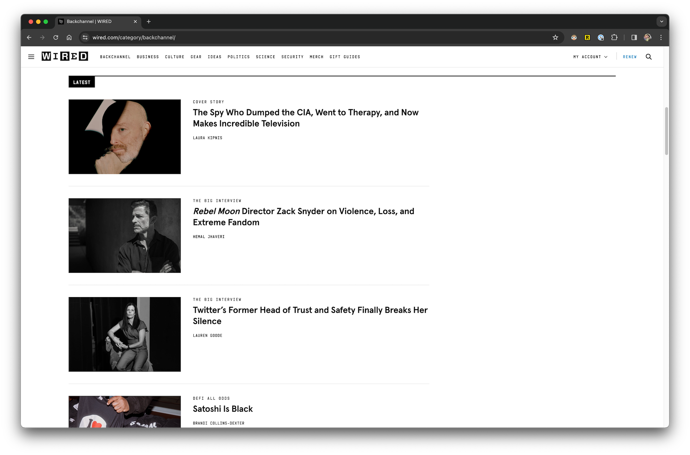
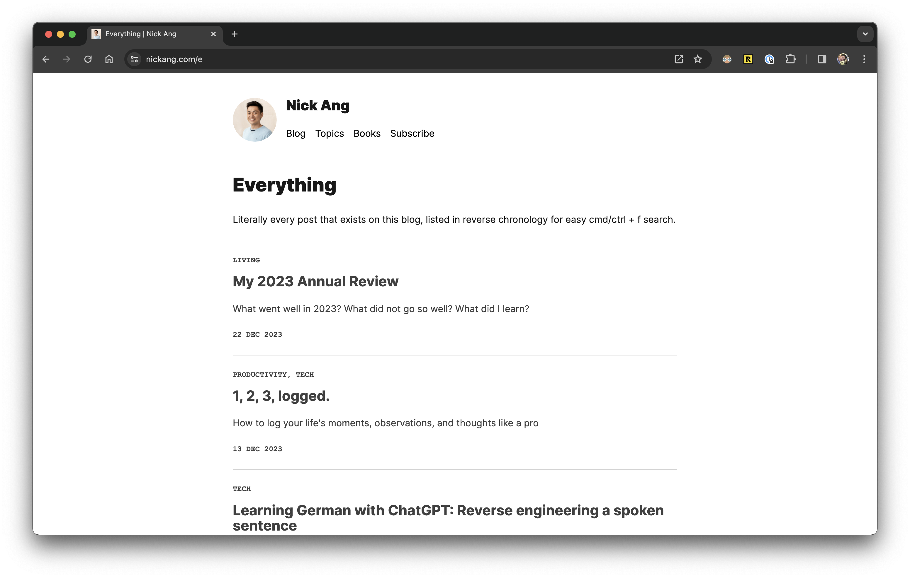

One thing that's been on my mind lately: publishing a post as a newsletter that lands in people's inboxes pushes me to think and write more clearly than publishing a post quietly on a blog like this one.

I've noticed that the quality of my writing (and by implication, thinking) in the last month has deteriorated. This is based purely on my subjective, qualitative measure of the posts I write. For the last month, I've only been publishing on my blog, and not to my newsletter audience of 200+ subscribers.

This should be a perfectly understandable phenomenon, right? We care what people think of us, and putting a post in front of people's eyes via an email newsletter is going to bring much more attention to us (through the writing) than via a blog post that quietly goes up.

Well, yes, and this is where I get uncomfortable because I've always thought that I hold myself to my standards, not that of others! If I held myself to my standards, then there shouldn't be a difference in the quality bar that needs to be met before a post gets published on any surface. Yet, it seems like the quality bar does differ for me based on its surface.

Maybe I'm just being naive. Maybe I care more about how I present my writing than I think. And maybe that's not such a bad thing. At least it's practical! People do care how you look. People do care how your writing is presented. People, all of whom are busy, make snap judgements based on these things, which ultimately determine if they will vote for you -- with their money, time, and energy -- or not.

## Enter Wired magazine

_Wired.com_

There's a man named Steven Levy who is the Editor-at-large at Wired magazine and has been covering technology for more than 30 years. He currently writes a weekly column called Plaintext and on there, he's a self-fashioned [tech pundit](https://www.wired.com/story/plaintext-trump-squeezed-americas-geek-squad-biden-built-it-back-stronger/#:~:text=I%20ask%20Hsiang%20how%20USDS%20regards%20generative%20AI%20because%2C%20well%2C%20my%20license%20as%20a%20tech%20pundit%20would%20be%20revoked%20if%20I%20failed%20to%20do%20that.) who _gets to_ determine the narrative and ask questions. That sounds fun, and I can feel the fun reading his words, like:

> I ask Hsiang how USDS regards generative AI because, well, my license as a tech pundit would be revoked if I failed to do that.

If I may say, that sounds just like how I would write if I simultaneously kept my writing standard high while retaining the tone of a personal narrative.

Sure, there are a bunch of the things that writers at places like Wired do that I don't yet do, like scheduling interviews with people and writing cover stories, which make Wired a household name and NickAng.com one that's unheard of. And here, I was going to say, "But the difference with Wired is I'm not trying to build a media business," but that is not true.

I do want to build a media business. Or at least I think I do. I'll need to interrogate this feeling more, but I think that's a mountain I wish to climb.

And my first step to climbing that mountain is to make this blog feel a little more like Wired. To that end, you can expect a few changes around here.

## Layout changes

I've chosen to display tags on each post on the post list page. This was previously hidden. My thinking is that this gives new readers an immediate idea of the kinds of things "we" write about here.

_This blog's [everything](/e) page_

I've also chosen to replace the excerpt with hand-written excerpts rather than truncating the post contents itself. My thinking here is that having to write an excerpt would make me think from the shoes of a person scanning the blog, and write words catered to that audience's browsing frame of mind that answers the question, "Why should I care about this?"

There are hundreds of posts that I've written that don't have excerpts, though, and I'm not sure I'll have the wherewithal to write all of them. I'll probably pick the ones that I think are worth reading and add excerpts to them.

And finally, I'm going to start using more images. If you compare the screenshot of Wired and that of this blog, you'll immediately notice how bare this blog looks because there are no featured images on each post on the listing page. I'm not going to change that yet, because I've gone down that route before and it's more often than not that I'd be stressed about finding a suitable image after writing a post. When I get more serious about the media business part is when I'll force myself to add featured images. For now, I'll use more images in posts.

## Content pruning

A plausible media business will be judged by the content it puts into the world, so some content pruning is in order around here.

Instead of deleting posts, I'll tag the ones that "don't meet the bar" and hide them from the main post listing page. They will live on for my daughter (and future me) to read them on a separate page that won't get too much attention from general readers.

My thinking here is that by hiding posts that weren't cut out to be remotely useful to readers, the overall perceived quality of this blog will increase a fewfold.

That's it!

So now the question is, is _this_ post useful to readers? To that, I'd say, yes. Why? You'll have to read the excerpt.
